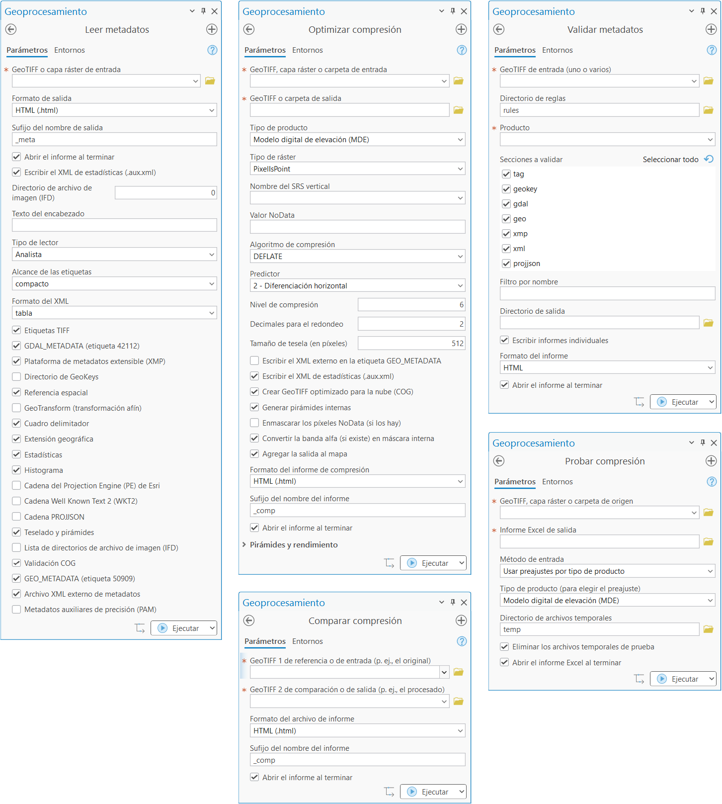

[English](README.md) | **Español**

# GeoTIFF ToolKit (GTTK): análisis y optimización de GeoTIFF

  
  

GTTK es un conjunto de herramientas en Python para analizar, optimizar y comprimir archivos
GeoTIFF. Esta guía está pensada para quien usa GTTK desde **ArcGIS Pro**: qué hace cada
herramienta, cómo instalarla y qué decisiones importan al comprimir. La
[documentación completa en inglés](README.md) cubre además la línea de comandos (`gttk`) y
los detalles para desarrolladores.

## Contenido

- [¿Qué es GTTK?](#qué-es-gttk)
- [¿Por qué usar GTTK?](#por-qué-usar-gttk)
- [La caja de herramientas para ArcGIS Pro](#la-caja-de-herramientas-para-arcgis-pro)
  - [Optimizar compresión](#optimizar-compresión)
  - [Comparar compresión](#comparar-compresión)
  - [Probar compresión](#probar-compresión)
  - [Leer metadatos](#leer-metadatos)
  - [Validar metadatos](#validar-metadatos)
- [Instalación rápida](#instalación-rápida)
- [Idioma de la caja de herramientas](#idioma-de-la-caja-de-herramientas)
- [Perfiles por tipo de producto](#perfiles-por-tipo-de-producto)
- [Buenas prácticas de compresión](#buenas-prácticas-de-compresión)
- [Línea de comandos y desarrollo](#línea-de-comandos-y-desarrollo)
- [Licencia y cita](#licencia-y-cita)

---

## ¿Qué es GTTK?

GTTK reúne cinco herramientas, disponibles desde un único comando `gttk` o desde la caja de
herramientas de ArcGIS Pro:

1. **Optimizar compresión**: comprime y convierte a GeoTIFF optimizado para la nube (COG) con
   valores predeterminados inteligentes según el tipo de producto.
2. **Comparar compresión**: valida el resultado de una compresión comparando el archivo
   original con el procesado.
3. **Probar compresión**: evalúa muchas configuraciones de compresión sobre un mismo archivo
   y documenta los resultados en Excel.
4. **Leer metadatos**: genera un informe detallado de los metadatos de un GeoTIFF en HTML o
   Markdown.
5. **Validar metadatos**: comprueba los metadatos de uno o muchos GeoTIFF contra las reglas de
   un producto.

Todas generan informes automáticamente, toman decisiones a partir de los datos y se integran
con ArcGIS Pro mediante la caja de herramientas incluida.

## ¿Por qué usar GTTK?

GTTK es más que un script de compresión: es un motor de optimización que reúne varias buenas
prácticas en un solo flujo de trabajo.

- **Resuelve el problema del datum vertical.** Para datos de elevación, GTTK construye
  sistemas de coordenadas compuestos (horizontal + vertical) de forma nativa, y evita errores
  que pueden producir desplazamientos verticales de varios metros. El datum vertical se elige
  por nombre: NAVD88, EGM2008, EGM96, CGVD2013 y otros. Para datos de México elija
  **NAVD88 (EPSG:5703)**, el datum vertical que establece la Norma Técnica para el Sistema
  Geodésico Nacional del INEGI; los modelos geoidales GGM10 y GGM25 son transformaciones
  entre alturas elipsoidales y ortométricas, no datums, y por eso no figuran en la lista
  (véase el [informe de ejemplo](example_reports/INEGI_f13a35e4_ms_NEW_meta.html)).
- **Rápido y eficiente.** Las operaciones se realizan en memoria con el sistema de archivos
  virtual de GDAL, sin escribir archivos intermedios.
- **Automatización de nivel experto.** Los valores predeterminados dependen del tipo de
  producto: GTTK elige el algoritmo, el predictor, el redondeo, las máscaras y el remuestreo
  de las pirámides adecuados para un MDE, una ortoimagen o un ráster temático.
- **Evita errores comunes.** Protecciones integradas impiden, por ejemplo, asignar el tipo de
  ráster equivocado (PixelIsArea frente a PixelIsPoint), omitir el SRS vertical en un MDE o
  promediar clases en las pirámides de un ráster categórico.
- **Comparación y pruebas.** *Comparar compresión* verifica la integridad de los datos tras
  comprimir; *Probar compresión* mide tamaño, eficiencia y velocidades de lectura y escritura
  con muchas configuraciones para encontrar la mejor.
- **Estandariza CRS no estándar.** Los GeoTIFF producidos con software de Esri suelen carecer
  de código EPSG; GTTK lo detecta y usa una tabla de equivalencias Esri → EPSG para mejorar la
  interoperabilidad.

## La caja de herramientas para ArcGIS Pro

La caja de herramientas `toolbox/GTTK_Toolbox.pyt` ofrece las cinco herramientas con cuadros
de diálogo validados, valores predeterminados inteligentes y actualizaciones dinámicas: al
cambiar el tipo de producto o el algoritmo, el resto de los parámetros se ajusta solo. La
interfaz aparece **en español o en inglés** según el idioma del sistema (véase
[Idioma de la caja de herramientas](#idioma-de-la-caja-de-herramientas)).

  
   
  <em>Los cinco cuadros de diálogo tal como se ven en un sistema en español; en un sistema en inglés aparecen en inglés</em>

### Optimizar compresión

Convierte un GeoTIFF —o todos los de una carpeta— en un COG comprimido y validado.

1. Elija el **GeoTIFF, capa ráster o carpeta de entrada** y la salida.
2. Elija el **Tipo de producto**: Modelo digital de elevación (MDE), Modelo de error,
   Ortoimagen o mapa base, Datos científicos o Datos temáticos. El cuadro de diálogo rellena
   el algoritmo, el predictor, los decimales de redondeo, las máscaras y el remuestreo de las
   pirámides con el perfil de ese tipo (véase [Perfiles por tipo de producto](#perfiles-por-tipo-de-producto)).
   Puede cambiar cualquier valor.
3. Para un MDE es obligatorio el **Nombre del SRS vertical** (p. ej., NAVD88, EGM2008,
   CGVD2013): con él se escribe el sistema de coordenadas compuesto.
4. Ejecute. Al terminar, la herramienta valida que la salida sea un COG correcto, genera un
   **informe de comparación** antes/después y, si lo desea, agrega el resultado al mapa.

El grupo **Pirámides y rendimiento** contiene las opciones avanzadas: remuestreo, compresión
y predictor de las pirámides, hilos de trabajo y si se genera el informe (desmárquelo en
lotes grandes).

### Comparar compresión

Compara dos GeoTIFF —normalmente el original y el comprimido— e informa de la reducción de
tamaño, la configuración de compresión detectada, la integridad de los datos (mínimo, máximo,
media), la validación COG y los cambios en los metadatos. *Optimizar compresión* la ejecuta
automáticamente; también puede usarla sola para revisar archivos procesados por terceros.

### Probar compresión

Toma un archivo de origen y lo comprime con decenas de combinaciones —según los preajustes
del tipo de producto o un CSV propio— midiendo tamaño, eficiencia y velocidades de lectura y
escritura. El resultado es un informe Excel con el que decidir la configuración de un producto
antes de procesar un lote completo.

### Leer metadatos

Genera un informe HTML o Markdown con las etiquetas TIFF, las GeoKeys, la referencia espacial
(WKT2, PROJJSON, cadena PE de Esri), el teselado y las pirámides, la validación COG, las
estadísticas e histogramas por banda y los metadatos XML incrustados o externos. Los
preajustes **Analista** (compacto) y **Productor** (completo) eligen las secciones; con
**Personalizado** las marca usted.

### Validar metadatos

Comprueba uno o muchos GeoTIFF contra las reglas de un producto definidas en archivos TOML:
etiquetas TIFF, GeoKeys, metadatos GDAL, XML incrustado, XMP y PROJJSON, con estadísticas
calculadas de los propios datos cuando la regla lo requiere. Produce un resumen JSON y, si lo
desea, un informe por archivo cuyo nombre indica si pasó (PASS) o falló (FAIL). Las reglas de
ejemplo están en `gttk/resources/rules/`; puede escribir las de sus propios productos.

## Instalación rápida

La caja de herramientas se usa desde una copia del repositorio; no se instala con `pip`.
En resumen:

| Paso | Acción |
|---|---|
| 1 | Instale **OSGeo4W** con GDAL (un GDAL independiente del que incluye ArcGIS Pro) |
| 2 | Indique la ruta de OSGeo4W en `config.toml` (`[paths] osgeo4w`) |
| 3 | Clone el entorno de Python de ArcGIS Pro desde el **Administrador de paquetes** |
| 4 | Instale los paquetes `tifffile` y `jsonpath-ng` en el entorno clonado y actívelo |
| 5 | En el panel **Catálogo**, agregue la carpeta `toolbox` como caja de herramientas |

Los detalles, la verificación y la solución de problemas están en la
**[guía de instalación en español](toolbox/README.es.md)**.

## Idioma de la caja de herramientas

La caja de herramientas elige el idioma cada vez que ArcGIS Pro la carga, y lo indica en la
primera línea de mensajes de cada ejecución (`Language: es (source: ...)`). El orden es:

1. La variable de entorno `GTTK_LANG` (`en` o `es`).
2. `config.toml`: `[gui] language = "auto"` (predeterminado), `"en"` o `"es"`.
3. El idioma elegido en ArcGIS Pro en **Opciones > Idioma** (solo aparece si está instalado
   un paquete de idioma de Esri).
4. El idioma de visualización de Windows.

Se traducen las etiquetas, las listas de opciones, los mensajes de validación, los mensajes
de la ejecución y el panel de ayuda de cada parámetro. Los informes, la salida de GDAL y la
línea de comandos permanecen en inglés.

Para forzar un idioma, escriba `language = "es"` (o `"en"`) en `config.toml` y, en el panel
Catálogo, haga clic derecho en la caja de herramientas → **Actualizar**. No hace falta
reiniciar ArcGIS Pro.

> **Nota:** la interfaz de ArcGIS Pro en español (cinta, paneles, mensajes de Esri) requiere
> el paquete de idioma español de Esri, que se descarga de My Esri y debe coincidir con la
> versión de Pro. GTTK no lo necesita: con Windows en español —o con `language = "es"`— la caja
> de herramientas aparece en español aunque Pro siga en inglés.

## Perfiles por tipo de producto

Estos son los valores con los que se rellena el cuadro de diálogo de *Optimizar compresión* al
elegir cada tipo de producto (los mismos que usa `gttk optimize -t TIPO` sin más opciones):

| Tipo (`-t`) | Algoritmo | Predictor | Decimales | Error Z máx. (LERC) * | Enmascarar NoData | Banda alfa a máscara | Remuestreo de pirámides | Tipo de ráster |
|---|---|---|---|---|---|---|---|---|
| `dem` (Modelo digital de elevación) | DEFLATE | 2 | 2 | 0.01 | No | Sí | BILINEAR | PixelIsPoint |
| `error` (Modelo de error) | DEFLATE | 2 | 1 | 0.1 | No | Sí | BILINEAR | PixelIsPoint |
| `scientific` (Datos científicos) | DEFLATE | 3 | ninguno | 0 | No | Sí | BILINEAR | PixelIsPoint |
| `image` (Ortoimagen o mapa base) | JPEG | - | - | n/a | Sí | Sí | NEAREST | PixelIsArea |
| `thematic` (Datos temáticos) | DEFLATE | 1 | - | 0 | No | No | NEAREST | PixelIsArea |

\* El error Z máximo solo se usa al elegir el algoritmo LERC; la columna muestra el valor que
LERC usaría. LERC no se ofrece para `image` y en `thematic` debe ser sin pérdida (`0`): una
tolerancia distinta de cero fusiona códigos de clase vecinos y se rechaza.

Otros valores dependen del códec y no del tipo de producto: el predictor y los decimales solo
se aplican a LZW, DEFLATE y ZSTD; la calidad (`90`) solo a JPEG y JXL; el nivel es `6` para
DEFLATE y `9` para ZSTD. El predictor 3 (punto flotante) pasa a 2 en datos enteros. Las
pirámides heredan el algoritmo y el predictor de la imagen principal salvo que se indique lo
contrario.

## Buenas prácticas de compresión

Un resumen de las recomendaciones de la [guía completa](README.md#user-recommendations--best-practices).

**Generales**

- No comprima los GeoTIFF en ZIP: el software no puede leerlos dentro del archivo y un COG
  no puede transmitirse por HTTP si está empaquetado.
- Compare siempre el archivo original con el comprimido (*Comparar compresión*) y, con
  compresión con pérdida, revíselo visualmente.
- Antes de procesar un lote grande, use *Probar compresión* para elegir la configuración.
- Mantenga la misma configuración en series temporales y documente el método de compresión
  al distribuir los datos (los informes de GTTK ya lo incluyen).

**Elección del algoritmo**

- **Imágenes multibanda (ortofotos, mapas base):** JPEG con calidad 90 (el predeterminado) o
  JXL con calidad 90, que comprime alrededor de un 25 % mejor, admite 16 bits y puede ser sin
  pérdida. Convierta la banda alfa en máscara interna (predeterminado).
- **Elevación y datos científicos:** DEFLATE es el predeterminado (buena compresión y máxima
  compatibilidad); ZSTD comprime igual o mejor y es mucho más rápido cuando el software lo
  admite; LZW solo por compatibilidad con software antiguo; LERC ofrece compresión con
  pérdida controlada para datos de punto flotante (0.01 m por defecto en un MDE).
- **Datos temáticos (cobertura del suelo, clases):** DEFLATE o ZSTD con predictor 1 y
  pirámides NEAREST (o MODE). Nunca un remuestreo que promedie: la media de las clases 2 y 4
  es la clase 3, que no existía en los datos.

**Redondeo.** Redondear los datos de punto flotante a una precisión razonable elimina la
pseudoprecisión y mejora mucho la compresión: 2 decimales (1 cm) para un MDE, 1 decimal
(10 cm) para un modelo de error, sin redondeo para datos científicos. Un Float32 solo
conserva unos 7 dígitos significativos, así que pedir más decimales de los que el tipo de
dato puede representar no aporta nada.

**COG y pirámides.** GTTK crea COG con teselas de 512 píxeles y pirámides internas de forma
predeterminada; use 256 para mapas web y 1024 para imágenes muy grandes. Las pirámides heredan
la compresión de la imagen principal, de modo que un archivo ZSTD no lleva pirámides LZW.

> **⚠️ Advertencia sobre LERC en MDE hidrológicamente condicionados.** LERC con pérdida es
> muy eficiente, pero **no es adecuado** para MDE condicionados hidrológicamente que alimentan
> modelos de escurrimiento: un cambio de 1 cm puede alterar la dirección de flujo o crear
> sumideros artificiales, sobre todo en drenajes pequeños. Para esos datos use LERC sin
> pérdida (error Z máximo = 0) o un algoritmo sin pérdida (DEFLATE, ZSTD, LZW).

**Calidad JXL.** GTTK traduce la calidad 0-100 al parámetro de distancia de JPEG XL con la
regla `distancia = (100 - calidad) × 0.1`: 100 es matemáticamente sin pérdida, 90 es
visualmente sin pérdida (el punto de equilibrio recomendado) y 75 equivale a un JPEG web.

## Línea de comandos y desarrollo

Las mismas cinco herramientas existen como subcomandos de `gttk` (`optimize`, `compare`,
`test`, `read`, `validate`), pensados para lotes y automatización; `gttk optimize
--show-defaults dem` muestra todos los valores resueltos para un tipo de producto. La
[documentación en inglés](README.md) describe cada argumento, y [DEVELOPER.md](DEVELOPER.md)
la arquitectura, las pruebas y cómo se mantienen las traducciones de la caja de herramientas.

## Licencia y cita

GTTK es software libre bajo la licencia MIT (véase [LICENSE](LICENSE)). Para citarlo, use
[CITATION.cff](CITATION.cff).
