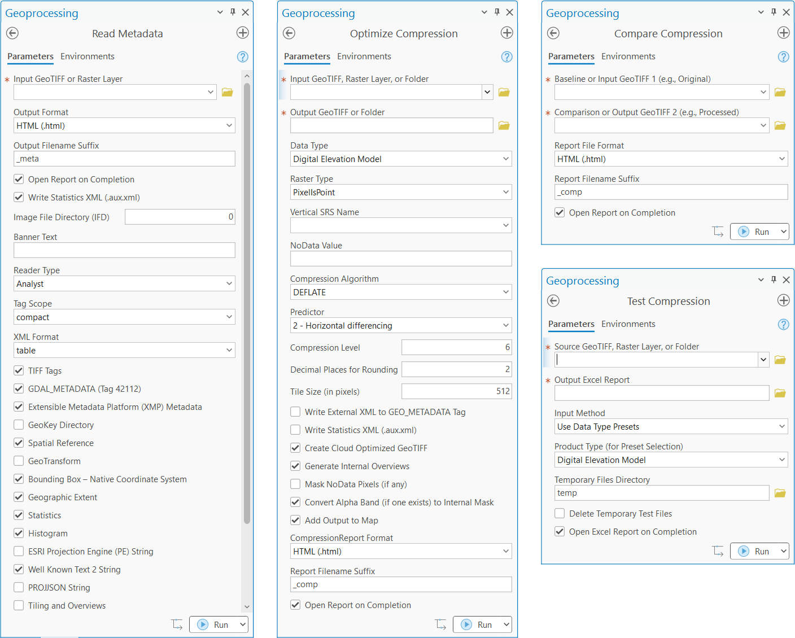
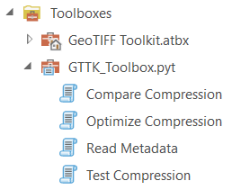

# GeoTIFF ToolKit (GTTK): GeoTIFF Analysis and Optimization Tools

<p align="left">
  
  
</p>

A Python toolkit for analyzing, optimizing, and compressing GeoTIFF files. GTTK provides a modular command-line interface (`gttk`) with four core tools designed for professional geospatial workflows, while an ArcGIS Pro Python toolbox provides Esri software users a convenient way to run each tool in a GUI while leveraging the full potential of GDAL.

## What is GTTK?

GTTK is a comprehensive suite of tools accessible through a single `gttk` command-line interface or ArcGIS toolbox. It provides four specialized modules:

1. **Compare Compression** (`gttk compare`): Validate compression results with side-by-side analysis
2. **Optimize Compression** (`gttk optimize`): Compress and create Cloud-Optimized GeoTIFFs (COGs) with intelligent defaults
3. **Test Compression** (`gttk test`): Benchmark multiple compression settings to find optimal configurations
4. **Read Metadata** (`gttk read`): Generate detailed metadata reports in HTML or Markdown format

All tools feature automated report generation, intelligent data-aware processing, and seamless integration with ArcGIS Pro via the included Python Toolbox.

## Why Use GTTK?

GTTK is more than a compression script—it's an optimization engine that combines multiple best practices into a cohesive, easy-to-use toolkit.

**Solves the Vertical Datum Problem**: For elevation data, GTTK handles compound coordinate systems natively, preventing common errors that can lead to vertical shifts of several meters. Assign vertical datums by name (e.g., `EGM2008`), EPSG code (e.g. `EPSG:5703`), or WKT string.

**Fast and Efficient**: All operations are performed in-memory using GDAL's virtual file system, avoiding intermediate file writes. This significantly improves performance, especially for large files or complex processing chains.

**Expert-Level Automation**: Intelligent, data-aware defaults make optimal choices for you. GTTK automatically selects the right predictor for compression algorithms, chooses appropriate resampling methods, and adapts workflows based on data type.

**Prevents Common Mistakes**: Built-in safeguards prevent errors like assigning the wrong raster type (PixelIsArea vs. PixelIsPoint) or failing to embed the vertical SRS in DEMs. The `compare` tool validates results, and the `test` tool helps you find the perfect balance between file size and performance for your products.

**Benchmarking and Validation**: The `compare` tool validates data integrity after compression. The `test` tool measures file size, compression efficiency, write speed, and read speed across multiple settings, helping you identify optimal configurations.

**Auto-Standardizes Non-Standard CRS**: GeoTIFFs from Esri software often lack EPSG codes. GTTK automatically detects these cases and uses an included Esri-to-EPSG lookup table to ensure better interoperability.

## Installation

### Prerequisites

- **Python 3.13+**
- **GDAL 3.11+**: Required for all geospatial operations

### Recommended: Conda Environment

Using Conda ensures all dependencies (especially GDAL) are properly managed:

```bash
# Create environment from the provided environment.yml
conda env create -f environment.yml

# Activate the environment
conda activate gttk
```

### Module Installation

After activating the environment, install GTTK as a Python module:

```bash
# For development (editable install)
pip install -e .

# For production
pip install .
```

This makes the `gttk` command available system-wide within your Conda environment.

### Key Dependencies

The `environment.yml` includes:

- `python>=3.13`
- `gdal>=3.11`
- `numpy`
- `tifffile`
- `matplotlib`
- `mistune`
- `pillow`
- `openpyxl`
- `lxml`

## Usage Guide

GTTK provides four specialized command-line tools, each designed for a specific workflow in GeoTIFF analysis and optimization. Every tool generates comprehensive reports to document results and validate changes.

The [`example_reports/`](example_reports/) directory contains sample HTML reports demonstrating each tool's output format. These examples are referenced below in the tool descriptions to illustrate real-world applications and results.

### The `gttk` Command

GTTK provides a unified command-line interface with four specialized tools. Use the `--help` flag to see available tools and options:

```bash
# Show all available tools
gttk --help

# Show help for a specific tool
gttk compare --help
gttk optimize --help
gttk test --help
gttk read --help
```

### Tool: Compare Compression (`gttk compare`)

#### Description

**Purpose**: Validate compression results by comparing baseline and processed GeoTIFF files.

Compression reports provide side-by-side comparison of baseline (input) and comparison (output) GeoTIFF files, including:

- File size reduction metrics
- Compression algorithm and settings comparison
- Data integrity validation (min/max/mean comparison)
- COG validation comparison
- Metadata changes summary
- Performance implications
- Visual quality assessment guidance

A compression report is also generated each time `gttk optimize` is run, comparing the input and output files to gauge the effectiveness of the optimization and break down the changes in data content and file structure.

#### Command-Line Arguments

| Argument | Short | Type | Required | Default | Description |
|----------|-------|------|----------|---------|-------------|
| `--input` | `-i` | Path | Yes | - | The baseline (or original) GeoTIFF for comparison |
| `--output` | `-o` | Path | Yes | - | The comparison (or processed) GeoTIFF |
| `--config` | `-c` | str | No | `config.toml` | Path to a custom configuration file |
| `--report-format` | `-f` | str | No | `html` | Output format for the report file (`html` or `md`) |
| `--open-report` | - | bool | No | `True` | Open the report automatically after generation |
| `--verbose` | `-v` | flag | No | `False` | Enable verbose logging |

#### Example Usage

```bash
# Compare original DEM with compressed version
gttk compare -i original_dem.tif -o compressed_dem.tif

# Generate Markdown report instead of HTML
gttk compare -i baseline.tif -o optimized.tif --report-format md
```

---

#### Example Reports

**1. [Pix4DMapper_ebee_ortho_JXL_comp.html](example_reports/Pix4DMapper_ebee_ortho_comp.html)**

**Description**: Pix4DMapper orthomosaic processed from ebee drone imagery

- The original image used LZW compression, which is very inefficient for imagery.
- The alpha band used for masking areas outside the mosaic was replaced with a transparency mask that also fixed edge effects while reducing file size.
- JXL compression at quality=90 (visually lossless) reduced the image size by 89% relative to the LZW compression.
- The input histogram displays the alpha band on a different axis so its bimodal distribution doesn't flatten the RGB bands.

**2. [USGS_1M_11_x33y541_WA_NorthCentral_2021_B21_comp.html](example_reports/USGS_1M_11_x33y541_WA_NorthCentral_2021_B21_comp.html)**

**Description**: A one-meter-resolution DEM produced through the USGS 3D Elevation Program (3DEP) in northern Washington State, available at [this link](https://www.sciencebase.gov/catalog/item/66726a21d34e84915adbb360).

- Confirms 2-decimal rounding in main image (IFD 0), which contains ~75% of pixels, but no rounding in overviews due to bilinear resampling.
- With the change from LZW -> DEFLATE and rounding, compression efficiency *doubled* for the main image, but improvement is more modest in the unrounded overviews.

### Tool: Optimize Compression (`gttk optimize`)

#### Description

**Purpose**: Create optimized, compressed GeoTIFF files with intelligent defaults and COG compliance.

This powerful tool combines multiple optimization techniques into a single, streamlined workflow:

- **In-memory processing** for maximum performance using GDAL's virtual file system
- **Automatic predictor selection** for optimal lossless compression (LZW/DEFLATE/ZSTD)
- **Native compound CRS handling** for elevation data with vertical datums
- **Alpha-to-mask conversion** for imagery (RGBA → RGB + internal mask)
- **Precision control via rounding** for floating-point data
- **Intelligent data-aware defaults** that adapt to product type
- **Multi-algorithm support**: JPEG, JXL, LZW, DEFLATE, ZSTD, LERC, and uncompressed
- **Lossy and lossless modes** with controlled quality/error thresholds
- **Cloud-Optimized GeoTIFF (COG) creation** with proper internal structure
- **Internal overview generation** with optimized tiling and resampling
- **NoData value remapping** and validation for data type compatibility
- **Custom vertical datum support** (EPSG codes, names, or WKT strings)
- **PixelIsPoint vs PixelIsArea** automatic assignment by product type with override option
- **Metadata preservation and enhancement** including external XML embedding
- **GeoTIFF v1.1 compliance** with WKT2 spatial reference encoding
- **Esri compatibility**: Automatic EPSG code lookup for non-standard CRS
- **Statistics calculation** with optional PAM .aux.xml generation
- **Automated comparison reports** showing before/after compression analysis

#### Command-Line Arguments

| Argument | Short | Type | Required | Default | Description |
|----------|-------|------|----------|---------|-------------|
| `--input` | `-i` | Path | Yes | - | Input source GeoTIFF file path |
| `--output` | `-o` | Path | Yes | - | Output COG file path |
| `--product-type` | `-t` | str | Yes | - | Type of GeoTIFF product (`dem`, `image`, `error`, `scientific`, `thematic`) |
| `--raster-type` | `-r` | str | No | Auto | Override raster type (`point` for PixelIsPoint, `area` for PixelIsArea) |
| `--algorithm` | `-a` | str | Yes | - | Compression algorithm (`JPEG`, `JXL`, `LZW`, `DEFLATE`, `ZSTD`, `LERC`, `NONE`) |
| `--vertical-srs` | `-s` | str | No | - | Vertical SRS for DEM products (required for `dem` type) |
| `--nodata` | `-n` | float | No | - | NoData value for DEM or error products |
| `--decimals` | `-d` | int | No | Auto | Decimal places for rounding DEM/error data |
| `--predictor` | `-p` | int | No | Auto | Predictor for LZW/DEFLATE/ZSTD compression (1, 2, or 3) |
| `--max-z-error` | `-z` | float | No | Auto | Max Z error for LERC compression |
| `--level` | `-l` | int | No | Auto | Compression level for DEFLATE or ZSTD |
| `--quality` | `-q` | int | No | `90` | JPEG/JXL quality (75-100) for image products |
| `--geo-metadata` | `-g` | bool | No | `False` | Write external XML metadata to the GEO_METADATA tag |
| `--write-pam-xml` | `-w` | bool | No | `True` | Write an Esri-compatible .aux.xml PAM statistics file |
| `--tile-size` | - | int | No | `512` | Tile size in pixels for primary layer and overviews |
| `--mask-alpha` | - | bool | No | `True` | Convert alpha band to internal mask (RGB+mask) vs. preserve RGBA |
| `--mask-nodata` | - | bool | No | Auto | Add NoData pixels to transparency mask |
| `--cog` | - | bool | No | `True` | Create a Cloud Optimized GeoTIFF |
| `--overviews` | - | bool | No | `True` | Generate internal overviews |
| `--report-format` | `-f` | str | No | `html` | Output format for the report file (`html` or `md`) |
| `--report-suffix` | - | str | No | `_comp` | Suffix for the report filename |
| `--open-report` | - | bool | No | `True` | Open the report automatically after generation |
| `--verbose` | `-v` | flag | No | `False` | Enable verbose logging |

#### Example Usage

```bash
# Compress a DEM with ZSTD, rounding to 2 decimal places
gttk optimize -i source_dem.tif -o output_dem.tif -t dem -a ZSTD \
  -v EGM2008 --decimals 2

# Compress an orthomosaic with JPEG
gttk optimize -i ortho.tif -o ortho_compressed.tif -t image -a JPEG -q 90

# Compress a thematic raster with DEFLATE
gttk optimize -i landcover.tif -o landcover_cog.tif -t thematic -a DEFLATE --nodata 0

# High-precision compression with LERC (1 cm max error for elevation in meters)
gttk optimize -i scientific.tif -o scientific_lerc.tif -t scientific -a LERC \
  --max-z-error 0.01
```

#### Example Reports

**1. [INEGI_f13a35e4_ms_comp.html](example_reports/INEGI_f13a35e4_ms_comp.html)**

**Description**: A 1.5m Digital Surface Model (DSM) over Mazatlán, Mexico produced and distributed by the Instituto Nacional de Estadística y Geografía (INEGI).The producer-grade (`--reader-type producer`) [OLD](example_reports/INEGI_f13a35e4_ms_OLD_meta.html) and [NEW](example_reports/INEGI_f13a35e4_ms_NEW_meta.html) metadata reports are provided for context.

- The external XML file referenced by the OLD file from the [INEGI website](https://www.inegi.org.mx/contenidos/productos/prod_serv/contenidos/espanol/bvinegi/productos/geografia/imagen_cartografica/1_10_000/lidar/1_5m/Superficie/889463844341_t.zip) was written to the internal GEO_METADATA TIFF Tag (#50909) in the NEW file.
- For comparison, the OLD report shows the XML in `text` format and the NEW report shows it in `table` format. While the information content is identical, the latter is much easier to read.
- GTTK translated the ISO-8859-1 (Latin-1) character encoding to UTF-8, preserving the special characters.
- The input NoData value (-3.402823466385289e+38) is problematic because it is read as `-inf` by software, causing calculation errors; mapping those pixels to NaN solved the problem.
- The NEW file assigns the vertical datum required by the Geoide Gravimétrico Mexicano 2010 (GGM10), which lacks an EPSG code. Because GeoTIFF only stores EPSG codes in GeoKeys, the full compound CRS is stored in the GDAL metadata item `CUSTOM_CRS_WKT2` so the information is not lost.
- The Esri Projection Engine (PE) String in the OLD header was removed from the NEW header because the 2D Projected CS was replaced with the 3D Compound CRS with GGM10 height.
- Updating from GeoTIFF v1.0 to v1.1 ([OGC GeoTIFF Standard](https://www.ogc.org/standards/geotiff/)) reduced the GeoKey Directory complexity, dropping GeoKey count from 17 to 8 and removing the "User-Defined" `GeographicCSTypeGeoKey`/`ProjectedCSTypeGeoKey` types assigned by Esri for the *horizontal* datum/CRS combo "Mexico ITRF2008 / UTM zone 13N" CRS.

**2. [USGS_ortho_054-083_comp.html](example_reports/USGS_ortho_054-083_comp.html)**

**Description**: 2015 East West Gateway 6-inch, 4-band Orthophotography over the Gateway Arch and downtown St. Louis, Missouri, USA. The analyst-grade (`--reader-type analyst`) [OLD](example_reports/USGS_ortho_054-083_OLD_meta.html) and [NEW](example_reports/USGS_ortho_054-083_NEW_meta.html) metadata reports are included for context.

- The original image distributed on the [USGS EarthExplorer website](https://earthexplorer.usgs.gov/scene/metadata/full/5e83a2397d63a400/3827956_054083/) is uncompressed.
- JXL compression at quality=90 (visually lossless) reduced the 4-band Color Near-Infrared (CNIR) image size by 88% (8.2x).
- The tiling and overviews were optimized and standardized: 128px (main image) and 64px (overview) tiles were replaced with 512px tiles everywhere.
- The output image is a valid COG, which is consistent with [earlier efforts](https://www.usgs.gov/news/technical-announcement/usgs-digital-elevation-models-dem-switching-new-distribution-format) by the USGS to distribute more of its content in that format.

---

### Tool: Test Compression (`gttk test`)

#### Description

**Purpose**: Benchmark multiple compression settings to find optimal configurations.

Compression Test reports benchmark multiple compression settings - chosen based on the product type or provided by the user as a custom list - to help identify optimal configurations. These metrics are compared to both the input GeoTIFF and a temporary uncompressed GeoTIFF that serves as a benchmark for performance. Each Excel spreadsheet includes:

- Test parameters for each compression configuration
- File size metrics (original size, compressed size, compression ratio)
- Write performance (speed at which file is written to disk)
- Read performance (speed at which file is loaded into RAM memory)
- Compression efficiency rankings
- Recommended optimal settings

File Size and Compression sections also include a `Delta (%)` column, which is the value relative to the original file. This apples-to-apples comparison helps to determine whether any compression configurations provide a substantial benefit, or the original file is good enough to keep unchanged.

#### Command-Line Arguments

| Argument | Short | Type | Required | Default | Description |
|----------|-------|------|----------|---------|-------------|
| `--input` | `-i` | Path | Yes | - | Source GeoTIFF file or directory for testing |
| `--output` | `-o` | Path | No | Auto | Path to save the output report table in Excel format (.xlsx) |
| `--csv-params` | `-c` | Path | Excl.¹ | - | Path to CSV file with compression parameters to test |
| `--product-type` | `-t` | str | Excl.¹ | - | Use preset template for product type (`dem`, `image`, `error`, `scientific`, `thematic`) |
| `--temp-dir` | - | Path | No | `temp/` | Directory to store temporary compressed GeoTIFFs |
| `--log-file` | - | Path | No | Auto | Path to a log file for debugging |
| `--delete-test-files` | - | bool | No | `True` | Delete temporary files after the test is complete |
| `--open-report` | - | bool | No | `True` | Open the Excel report automatically after generation |
| `--verbose` | `-v` | flag | No | `False` | Enable verbose logging |

*¹ Mutually exclusive: Either `--csv-params` or `--product-type` must be provided.*

#### Example Usage

```bash
# Test DEM compression with preset DEM template options -
# see: gttk/resources/templates/compression_options_dem.csv
gttk test -i source_dem.tif -t dem

# Test all GeoTIFF files in a directory (assumes all are valid image products)
# see: gttk/resources/templates/compression_options_image.csv
gttk test -i input_directory/ -t image

# Test with custom CSV parameters
gttk test -i ortho.tif -c custom_params.csv
```

#### Example Reports

**1. [Pix4DMapper_ebee_ortho_test.xlsx](example_reports/Pix4DMapper_ebee_ortho_test.xlsx)**

**Description**: Pix4DMapper orthomosaic processed from ebee drone imagery

- Removing the predictor (1=None) reduced the compression by 20%.
- DEFLATE and ZSTD increase efficiency ~20%, but the lossless predictive algorithms don't come close to JPEG and JXL!
- Visually lossless (Quality=90) JPEG with YCbCr colorspace is 85.5% more efficient than LZW (92.4% total).
- Visually lossless JXL is 89.1% more efficient than LZW (95.5% total).
- True JXL lossless is still twice as efficient as LZW (80.7% total).
- In this example, JXL is ~25% more efficient than JPEG with fewer visual artifacts but significantly lower read speed.

**2. [USGS_1M_11_x33y541_WA_NorthCentral_2021_B21_test.xlsx](example_reports/USGS_1M_11_x33y541_WA_NorthCentral_2021_B21_test.xlsx)**

**Description**: A one-meter-resolution DEM produced through the USGS 3D Elevation Program (3DEP) in northern Washington State, available at [this link](https://www.sciencebase.gov/catalog/item/66726a21d34e84915adbb360).

- Changing from LZW (the input algorithm) to DEFLATE reduced file size by ~20%.
- Changing Predictor from 3 (Floating-point) to 2 (Horizontal differencing) after rounding to 1 cm reduced it by another ~20%.
- Using Predictor 2 *without* rounding increased file size by ~10%, indicating Predictor 3 is better for full-precision data.
- ZSTD is ~3% more efficient than DEFLATE and loads faster into memory.
- Lossless LERC (Max Z Error = 0) achieves only ~5% compression, making it the least efficient algorithm.
- Controlled lossly LERC with 1 cm precision (Max Z Error = 0.01) achieves the highest compression at ~75% (55% improvement over unrounded LZW).
- While DEFLATE is slower to read/write, this difference has no performance impact in GIS browsers with tiled COGs as each tile loads in milliseconds on modern processors.

---

### Tool: Read Metadata (`gttk read`)

#### Description

**Purpose**: Extract and display comprehensive metadata from GeoTIFF files.

Metadata reports provide comprehensive information about a single GeoTIFF file, including:

- File overview (size, dates, compression efficiency, and transparency type)
- "Compact" (essential) or "Complete" (everything) TIFF tag listing with numeric values and text descriptions
- Embedded XML metadata (formatted or syntax-highlighted)
- GeoKeys (projection, datum, ellipsoid, raster type, etc.)
- Spatial Reference (a readable summmary of the projection information for analysts)
- Spatial Extent rendered in Bounding Box, GeoTransform and Geographic Extent sections
- Syntax-highlighted Well Known Text 2 (WKT2) and PROJJSON strings
- Band statistics and histograms
- Tables with detailed Tiling and Overview breakdowns
- Table listing Image File Directory (IFD) properties including transparency mask and overviews with compression details
- COG validation status
- Internal and external XML metadata as a syntax-highlighted XML string or table

#### Command-Line Arguments

| Argument | Short | Type | Required | Default | Description |
|----------|-------|------|----------|---------|-------------|
| `--input` | `-i` | Path | Yes | - | Path to the input GeoTIFF file |
| `--page` | `-p` | int | No | `0` | Image File Directory (IFD) page to read |
| `--banner` | `-b` | str | No | - | Text for a banner at the top/bottom of report (e.g., classification) |
| `--reader-type` | `-r` | str | Excl.¹ | `producer` | Target reader type (`analyst` or `producer`) |
| `--sections` | `-s` | str[] | Excl.¹ | - | Specific metadata sections to include in the report |
| `--xml-type` | `-x` | str | No | `table` | Present metadata as `table` or syntax-highlighted `text` |
| `--tag-scope` | `-t` | str | No | `complete` | Level of detail for TIFF tags (`complete` or `compact`) |
| `--write-pam-xml` | `-w` | bool | No | `False` | Write an Esri-compatible .aux.xml PAM statistics file |
| `--report-format` | `-f` | str | No | `html` | Format for the output report (`html` or `md`) |
| `--report-suffix` | - | str | No | `_meta` | Suffix to append to the output report filename |
| `--open-report` | - | bool | No | `True` | Open the report automatically after generation |
| `--verbose` | `-v` | flag | No | `False` | Enable verbose logging |

*¹ Mutually exclusive: If `--sections` is not provided, defaults to use `--reader-type`.*

#### Example Usage

```bash
# Generate comprehensive metadata report
gttk read -i example.tif

# Generate compact report for analysts
gttk read -i example.tif --reader-type analyst --tag-scope compact

# Generate Markdown report with custom banner
gttk read -i classified.tif --report-format md --banner "UNCLASSIFIED"
```

#### Example Reports

**1. [ASTER_PCA_bands1-9_meta.html](example_reports/ASTER_PCA_bands1-9_meta.html)**

**Description**: A multi-band Principal Component Analysis (PCA) over the Gobi Desert in Mongolia, constructed from all 9 VNIR and SWIR bands of the Advanced Spaceborne Thermal Emission & Reflectance Radiometer (ASTER) satellite. Raw data are from [AST_07XT_00404082004040535_20250325113927](s3://lp-prod-protected/AST_07XT.004/AST_07XT_00404082004040535_20250325113927/AST_07XT_00404082004040535_20250325113927.cmr.json).

- Synchronizes font and patch colors between GDAL metadata, Statistics band columns and Histogram chart.
- Displays a layered histogram with all bands in one chart for contrast and to reduce real estate.
- Reports *both* NoData and Transparency Mask pixel types (while redundant, dataset uses both per pixel to display correctly in most common GIS browsers).

**2. [us_nga_egm08_1_meta.html](example_reports/us_nga_egm08_1_meta.html)**

**Description**: The Earth Gravitational Model of 2008 (EGM2008) at 1 arc minute resolution. EGM2008 is a product of the U.S. National Geospatial-Intelligence Agency (NGA) [Office of Geomatics](https://earth-info.nga.mil/).

- Reports the essential metadata required for the [Geodetic TIFF Grid (GTG)](https://proj.org/en/stable/specifications/geodetictiffgrids.html) specification used by PROJ.
- Uses Spatial Reference, Bounding Box, and WKT sections to describe the 3D Geographic WGS 84 CRS (`EPSG:4979`)
- Confirms that the EGM is a COG - a critical requirement for a GTG, supporting near-instant retrieval of geoid height anywhere in the world.

---

## ArcGIS Pro Toolbox

The GTTK ArcGIS Pro Toolbox stored in `toolbox/GTTK_Toolbox.pyt` provides a complete GUI interface for GIS analysts who prefer point-and-click workflows over command-line interfaces. The toolbox abstracts the complexity of 20+ command-line arguments into intuitive, validated parameter dialogs with smart defaults and dynamic updates.

**Key Benefits**:

- **Visual parameter selection** with validation and helpful descriptions
- **Dynamic UI updates** that adjust available options based on product type and algorithm
- **Integrated with ArcGIS workflows** - add outputs directly to maps
- **Automatic report generation** with options to open results immediately
- **Four complete tools** matching all CLI capabilities

<p align="center">
  
  <br>
  <em>The Optimize Compression tool showing intelligent parameter organization and dynamic updates</em>
</p>

**Quick Start for Existing QGIS/OSGeo4W Users**: If you already have QGIS installed, you likely have OSGeo4W configured. Look for "OSGeo4W Shell" in your Windows Start menu to confirm. If found, you can skip the OSGeo4W installation section below and proceed directly to [Python Environment Setup](#python-environment-setup).

### OSGeo4W Installation (Required Dependency)

**CRITICAL PREREQUISITE**: For the ArcGIS Pro Toolbox to function properly, you must have a standalone GDAL environment installed. The GDAL library bundled with ArcGIS Pro uses internal configuration settings that can override optimizations implemented through the GDAL Python API.

To work around this limitation, GTTK includes a specialized tool (`gttk optimize-arc`) that uses GDAL command-line utilities (`gdal_translate`, `gdal_calc.py`, `gdalwarp`, `gdaladdo`) executed via subprocess in an isolated OSGeo4W environment. This ensures optimal results while maintaining compatibility with ArcGIS Pro.

GTTK uses OSGeo4W, which provides access to the latest GDAL features and compression codecs while remaining isolated from ArcGIS Pro's internal GDAL. Another benefit of using the OSGeo4W installer is access to the free GIS software [QGIS](https://qgis.org) (see [Installing QGIS via OSGeo4w](#installing-qgis-via-osgeo4w) below).

> **Note**: For CLI users, `gttk optimize-arc` is also available as a standalone tool. See [Advanced Tools: gttk optimize-arc](#advanced-tools-gttk-optimize-arc) for details.

#### Installation Instructions

##### Step 1: Download OSGeo4W Installer

Download the appropriate installer for your system:

- **64-bit Windows (Recommended)**: [OSGeo4W-v2-setup.exe](http://download.osgeo.org/osgeo4w/v2/osgeo4w-setup.exe)
- **Official Download Page**: [https://trac.osgeo.org/osgeo4w/](https://trac.osgeo.org/osgeo4w/)

> **Note**: The v2 installer is the modern, recommended version. Avoid the legacy v1 installer unless you have specific requirements.

##### Step 2: Run the Installer

1. **Launch** the downloaded `osgeo4w-setup.exe` with administrator privileges (right-click → "Run as administrator")

2. **Choose Installation Type**:
   - Select **"Express Install"** for a quick, standard setup (recommended for most users)
   - OR select **"Advanced Install"** for granular package control (experienced users)

##### Step 3: Select Packages (Express Install)

If using Express Install, select:

- ☑ **QGIS Desktop** - Includes QGIS and core dependencies
- ☑ **GDAL** - Geospatial Data Abstraction Library (core requirement)

##### Step 3 Alternative: Select Packages (Advanced Install)

If using Advanced Install, you'll have more control over specific packages:

**Required Packages:**

- ☑ **gdal** - Core GDAL library (select latest stable version)
- ☑ **gdal-python** - Python bindings for GDAL
- ☑ **python3-core** - Python interpreter

**Recommended Packages:**

- ☑ **qgis** - QGIS Desktop application (see below)
- ☑ **qgis-grass-plugin** - GRASS GIS integration (optional)
- ☑ **gdal-ecw** - ECW format support (if needed)
- ☑ **gdal-mrsid** - MrSID format support (if needed)

**Advanced Codec Packages** (for maximum compression options):

- ☑ **gdal-jxl** - JPEG XL codec support
- ☑ **gdal-zstd** - ZSTD compression support
- ☑ **gdal-lerc** - LERC compression support

##### Step 4: Choose Installation Location

- **Default Location**: `C:\OSGeo4W` (recommended)
- **Custom Location**: Choose a path without spaces or special characters
- **Important**: Remember this path - you'll need it for GTTK configuration

##### Step 5: Complete Installation

1. Review selected packages
2. Click **"Next"** to download and install
3. Wait for installation to complete (may take several minutes)
4. Click **"Finish"** when done

#### Post-Installation Configuration

##### Configure GTTK to Use OSGeo4W

After installation, update the GTTK configuration to point to your OSGeo4W installation:

1. **Open** `config.toml` in the GTTK project root directory

2. **Locate** the `[paths]` section:

   ```toml
   [paths]
   # Path to OSGeo4W installation (required for ArcGIS Toolbox)
   osgeo4w = "C:/OSGeo4W"
   ```

3. **Update** the `osgeo4w` path if you installed to a custom location:

   ```toml
   [paths]
   osgeo4w = "C:/Your/Custom/Path/OSGeo4W"
   ```

##### Verify Installation

Open **OSGeo4W Shell** (search for it in the Start Menu) and run:

```bash
# Check GDAL version
gdalinfo --version

# Check available drivers
gdalinfo --formats

# Check Python GDAL bindings version
python3 -c "from osgeo import gdal; print(gdal.__version__)"
```

Expected output should show:

- Long list of supported drivers including GTiff and COG
- Python GDAL version matching the GDAL library (3.11+ or the latest available)

#### Installing QGIS via OSGeo4W

While QGIS is an excellent tool and valuable for GIS workflows, standalone QGIS installations may lack the complete OSGeo4W dependencies that GTTK requires. The OSGeo4W installer provides:

- **Complete GDAL Environment**: All necessary GDAL libraries, tools, and dependencies
- **Latest Compression Codecs**: Access to modern codecs like JPEG XL (JXL), ZSTD, and LERC
- **QGIS as an Option**: Includes QGIS among selectable packages - you get both!
- **Python Bindings**: GDAL Python bindings for scripting and automation
- **Consistent Updates**: Centralized update mechanism for all geospatial tools
- **Proven Compatibility**: Widely used in professional and government environments

**Benefits of Having Both ArcGIS Pro and QGIS:**

- Access to both proprietary and open-source toolsets
- QGIS excels at certain tasks (e.g., styling, PostgreSQL/PostGIS integration, raster modeling with GDAL, etc.)
- ArcGIS provides a wide suite of industry- and government-adopted mapping tools and the ArcPy environment (used by GTTK's Toobox)
- Support for analytical workflows locked behind ArcGIS Pro extensions (e.g. Spatial Analyst) requiring additional licensing
- Access to hundreds of community-developed plugins supporting unique tools
- Open-source transparency and community support

#### Troubleshooting

**Common Issues and Solutions:**

1. **"GDAL not found" error in ArcGIS Pro Toolbox**:
   - Verify `osgeo4w` path in `config.toml` points to the correct location
   - Ensure path points to the OSGeo4W root directory (e.g., `C:/OSGeo4W`)
   - Restart ArcGIS Pro after changing configuration

2. **"Missing codec" errors (JXL, ZSTD, etc.)**:
   - Run OSGeo4W installer again and select advanced codec packages
   - Verify packages are installed: check `C:\OSGeo4W\bin\gdal\plugins`

3. **Permission errors during installation**:
   - Run installer as administrator
   - If on a managed corporate/government system, contact IT department
   - Consider installing to user-writable directory if needed

4. **PATH conflicts with other GDAL installations**:
   - GTTK uses explicit path configuration to avoid conflicts
   - Do NOT add OSGeo4W to system PATH if you have other GDAL installations
   - GTTK will use the path specified in `config.toml`

**Getting Help:**

- OSGeo4W User Guide: [https://trac.osgeo.org/osgeo4w/wiki/TracGuide](https://trac.osgeo.org/osgeo4w/wiki/TracGuide)
- GDAL Documentation: [https://gdal.org/](https://gdal.org/)
- GTTK Issues: [Create an issue on GitHub](https://github.com/robeckgeo/gttk/issues)

### Python Environment Setup

**CRITICAL DEPENDENCY**: The `tifffile` module is required for GTTK to function properly. This package is **not** included in the default ArcGIS Pro `arcgispro-py3` conda environment and must be installed in a custom environment.

#### Setting Up Your Environment:**

1. **In ArcGIS Pro, click on the Project menu** and open the `Package Manager`. This manages the Python ArcPy conda environment(s). The pre-installed, default environment is `arcgispro-py3`.

2. **Clone the default environment** into a new environment (e.g., `arcgispro-gttk`). This may take some time. If the clone fails, you may need to work with your IT department. If you already have a cloned environment (not `arcgispro-py3`), you may use that.

3. **Make the cloned environment active**, then click on the `Add Packages` tab in the ArcGIS Pro Package Manager.

4. **Search for "tifffile"** and install it. The package is available in the default conda channels.

5. **Ensure that the same environment is active** when running GTTK tools from the toolbox.

#### Toolbox Setup Instructions

1. **Add Toolbox**: In your ArcGIS Pro Project, open the **Catalog** pane, right-click **Toolboxes** and select **Add Toolbox**. Navigate to and select the `toolbox` folder in the project's root directory.
2. **Locate Toolbox**: The `GTTK_Toolbox.pyt` toolbox will be visible in the Toolboxes folder. You can now expand it to use the tools.

      

---

## Configuration

GTTK uses a `config.toml` file for system-specific settings. This is primarily relevant for ArcGIS Pro Toolbox users who need to configure the OSGeo4W path.

### Key Settings

```toml
[paths]
# Path to OSGeo4W installation (required for ArcGIS Toolbox)
osgeo4w = "C:/OSGeo4W"

[logging]
# Logging Configuration
level = "INFO"
file = "gttk.log"
```

### When to Edit

- **ArcGIS Pro Users**: Update `osgeo4w` path in `config.toml` to match your OSGeo4W installation
- **CLI Users**: Generally no configuration needed; all settings can be passed as command-line arguments
- **Batch Processing**: Customize defaults in `config.toml` to streamline repetitive tasks

**Location**: `config.toml` in the project root directory

---

## Advanced Tools: `gttk optimize-arc`

### Overview

`gttk optimize-arc` is a specialized variant of the `gttk optimize` command designed for environments that require GDAL command-line utilities instead of Python API bindings. While primarily used by the ArcGIS Pro Toolbox, it's also available as a standalone CLI tool.

### Key Differences from `gttk optimize`

| Feature | `gttk optimize` | `gttk optimize-arc` |
|---------|-----------------|---------------------|
| **Execution Method** | GDAL Python API (in-memory) | GDAL CLI utilities (subprocess) |
| **Performance** | Faster (no subprocess overhead) | Slightly slower (subprocess calls) |
| **ArcGIS Compatibility** | Limited (ArcGIS GDAL conflicts) | Full (isolated environment) |
| **Command Logging** | Not available | Logs all GDAL commands executed |
| **Use Case** | General CLI use, batch scripts | ArcGIS Toolbox, debugging GDAL workflows |

### Why Use `gttk optimize-arc`?

1. **ArcGIS Pro Integration**: Required for the ArcGIS Toolbox to work correctly
2. **Command Logging**: Generates a log of all GDAL commands for debugging or learning
3. **Developer Tool**: Understand the GDAL workflow by examining logged commands
4. **Reproducibility**: Commands can be extracted and run independently

### Usage

The command-line interface is identical to `gttk optimize`:

```bash
# Standard usage - identical to gttk optimize
gttk optimize-arc -i input.tif -o output.tif -t dem -a ZSTD -v EGM2008 --decimals 2

# Batch processing
gttk optimize-arc -i input_dir/ -o output_dir/ -t image -a JPEG -q 90
```

### Command Log Output

When using `gttk optimize-arc`, all GDAL commands are logged. Example output:

```
GDAL commands staged. Total commands: 4
---------------------------------------

> gdal_calc.py --calc numpy.where(A == -3.4028235e+38, numpy.nan, A) -A C:/code/GeoTiffToolKit/input/INEGI/889463844341_t/conjunto_de_datos/f13a35e4_ms.tif --outfile C:/Users/john/AppData/Local/Temp/gttk_569d65857c3a46689d9b19a45fd4e121/nodata_remapped.tif --type Float32

> gdal_calc.py --calc round(A, 2) -A C:/Users/john/AppData/Local/Temp/gttk_569d65857c3a46689d9b19a45fd4e121/nodata_remapped.tif --outfile C:/Users/john/AppData/Local/Temp/gttk_569d65857c3a46689d9b19a4

> gdal_calc.py --calc round(A, 2) -A C:/Users/john/AppData/Local/Temp/gttk_569d65857c3a46689d9b19a45fd4e121/nodata_remapped.tif --outfile C:/Users/john/AppData/Local/Temp/gttk_569d65857c3a46689d9b19a45fd4e121/rounded.tif --overwrite --type Float32

> gdal_translate --config OSR_WKT_FORMAT WKT2_2019 --config GTIFF_WRITE_SRS_WKT2 YES --config GTIFF_SRS_SOURCE WKT -of GTiff -co TILED=YES -mo AREA_OR_POINT=Area -mo TIFFTAG_SOFTWARE=GeoTIFF ToolKit v0.8.0 -mo AREA_OR_POINT=Point -a_nodata nan C:/Users/john/AppData/Local/Temp/gttk_569d65857c3a46689d9b19a45fd4e121/rounded.tif C:/Users/john/AppData/Local/Temp/gttk_569d65857c3a46689d9b19a45fd4e121/preprocessed.tif

> python C:/Users/john/AppData/Local/Temp/gttk_569d65857c3a46689d9b19a45fd4e121/run_translate.py    

---------------------------------------
```

### Technical Details

- **Isolated Environment**: Executes in OSGeo4W environment via `gdal_runner.py`
- **Temporary Files**: Uses disk-based temporary files (vs in-memory for `gttk optimize`)
- **Output Reports**: Generates identical comparison reports to `gttk optimize`

### When to Use Each Tool

- **Use `gttk optimize`** (standard):
  - CLI workflows outside ArcGIS Pro
  - Best performance for large files
  - Python scripting integration
  
- **Use `gttk optimize-arc`**:
  - ArcGIS Pro Toolbox (automatic)
  - Debugging GDAL workflows
  - Learning GDAL command patterns
  - Need reproducible command logs

---

## User Recommendations & Best Practices

### Compression Best Practices

Modern datasets are increasingly large, and cloud storage costs are directly proportional to data volume. This section provides practical guidance for optimizing GeoTIFF compression using GTTK.

#### General Best Practices

1. **Avoid External Compression**: Never zip GeoTIFF files. Software cannot read files inside compressed archives, and Cloud Optimized GeoTIFFs (COGs) cannot be streamed via HTTP when containerized.

2. **Quality Checks**: Always perform quality checks before and after compression using `gttk compare` to ensure data integrity.

3. **Visual Inspection**: When using lossy compression (JPEG, JXL, or lossy LERC), conduct visual inspections to verify quality requirements are met.

4. **Documentation**: Document all compression settings and processes in metadata and accompanying reports (GTTK does this automatically in comparison reports).

5. **Test First**: Use `gttk test` to determine optimal compression settings for your specific data types and use cases before processing large datasets.

6. **Consistency**: For time-series or multi-temporal datasets, use consistent compression approaches across all files to maintain comparability.

7. **Clear Distribution Info**: When distributing data, provide information about compression methods used (GTTK reports include this automatically).

#### Algorithm Selection Guide

**For Multi-Band Imagery:**

- **Primary Choice**: JPEG with `--quality=90` for photographic/satellite imagery
- **Alternative**: JXL with `--quality=90` for better compression (~25% better than JPEG), 16-bit imagery and modern codec support
- **Considerations**:
  - Use `--mask-alpha=True` (default) to convert RGBA to RGB+mask
  - Use `--mask-nodata=True` (default) for imagery with NoData values
  - YCbCr color space is automatically applied by GTTK for JPEG

**For Elevation and Scientific Data:**

*DEFLATE (Zip):*

```bash
gttk optimize -i input.tif -o output.tif -t dem -a DEFLATE -v EPSG:5703 --predictor=3
```

- **Strengths**: Good compression, widely supported, stable
- **Weaknesses**: Slower than LZW/ZSTD, less efficient than ZSTD/LERC
- **Use Case**: General-purpose lossless compression with broad compatibility (the default)

*LZW (Lempel-Ziv-Welch):*

```bash
gttk optimize -i input.tif -o output.tif -t dem -a LZW -v EPSG:5703 --predictor=2
```

- **Strengths**: Lossless, widely supported, predictable performance
- **Weaknesses**: Less efficient than DEFLATE/ZSTD, slower than ZSTD
- **Use Case**: Legacy software compatibility required

*ZSTD (ZStandard):*

```bash
gttk optimize -i input.tif -o output.tif -t dem -a ZSTD -v EPSG:5703 --predictor=3
```

- **Strengths**: Excellent compression, very fast, flexible compression levels (1-22)
- **Weaknesses**: May not be supported in legacy software
- **Use Case**: Recommended for elevation/scientific data when software supports it

*LERC (Limited Error Raster Compression):*

```bash
# Lossless
gttk optimize -i input.tif -o output.tif -t dem -a LERC -v EPSG:5703

# Near-lossless (1 cm max error for elevation in meters)
gttk optimize -i input.tif -o output.tif -t dem -a LERC -v EPSG:5703 --max-z-error=0.01
```

- **Strengths**: Excellent compression for floating-point data, quantifiable error tolerance
- **Weaknesses**: Not supported in all legacy software, not optimal for integer data
- **Use Case**: Floating-point scientific data where controlled precision loss is acceptable
- **⚠️ Warning**: See section below regarding hydro-conditioned DEMs

#### Predictor Optimization (LZW, DEFLATE, ZSTD)

GTTK automatically selects optimal predictors, but you can override:

- **Predictor 1 (None)**: Data compressed as-is. Generally suboptimal for most geospatial data, with the exception of thematic data.
- **Predictor 2 (Horizontal Differencing)**: Highly effective for integer data and smooth or rounded floating-point data. GTTK's default for DEM and Error Models with rounding to 1 or 2 decimals.
- **Predictor 3 (Floating-Point)**: Designed for floating-point data. Best for unrounded floating-point data with high variability (noise).

**Recommendation**: Use `gttk test` to compare Predictor 2 vs. 3 for your specific floating-point datasets.

#### Rounding for Improved Compression

For floating-point elevation data, rounding can significantly improve compression efficiency:

```bash
# Round DEM to 2 decimal places (1 cm precision)
gttk optimize -i input.tif -o output.tif -t dem -a ZSTD -v EPSG:5703 --decimals=2 --predictor=2

# Round error model more aggressively (1 decimal = 10 cm precision)
gttk optimize -i error.tif -o error_compressed.tif -t error -a DEFLATE --decimals=1 --predictor=2
```

**Benefits of Rounding:**

- Removes pseudo-precision beyond sensor/software accuracy
- Increases data repetition, improving dictionary-based compression (LZW/DEFLATE/ZSTD)
- Creates more identical adjacent values in smooth terrain
- Results in cleaner, easier-to-read data queries

**Guidelines:**

- DEM data: 2 decimal places (1 cm precision)
- Error models: 1 decimal place (10 cm precision)
- Bathymetry: Match the precision of your sonar equipment
- Document rounding or decimal precision in metadata (GTTK does this automatically)

#### Cloud Optimized GeoTIFF (COG) Settings

GTTK creates COGs by default (`--cog=True`). Key parameters:

- **Tile Size**: Default 512×512 pixels (`--tile-size=512`). Recommended: 256 for web mapping, 1024 for very large images or processing workflows.
- **Overviews**: Enabled by default (`--overviews=True`). Required for efficient visualization and web streaming.
- **Internal Structure**: GTTK automatically creates proper internal tiling and overview structure for COG compliance.

**Validation**: GTTK automatically validates COG structure and reports compliance in comparison reports.

### ⚠️ LERC Compression Warning for Hydro-Conditioned DEMs

While **lossy** LERC (Limited Error Raster Compression) is highly efficient and allows for controlled near-lossless compression, **it is not suitable for hydro-conditioned Digital Elevation Models (DEMs)** used in hydrologic modeling software.

**Why This Matters:**

- Hydrologic models rely on precise stream elevations and flow directions
- Even a small elevation change (e.g., 1 cm) can alter stream flow direction or create artificial sinks
- This primarily impacts smaller drainages with monotonic stream increments given the 8x8 pixel LERC block size
- The effect cannot be ruled out entirely for any hydro-conditioned dataset

**Recommendations:**

- For hydro-conditioned DEMs: Use **lossless LERC** (`--max-z-error=0`) or lossless algorithms like DEFLATE, ZSTD, or LZW (note: lossless LERC is the **least** efficient algorithm)
- For general-purpose terrain models, error models and scientific data: Lossy LERC with appropriate `--max-z-error` values is acceptable
- When in doubt, use `gttk test` to benchmark different settings and validate results with `gttk compare`

### Understanding JXL Quality Settings

The `--quality` argument for JPEG XL (JXL) compression bridges the gap between the scientific, psychovisual parameters of modern codecs and the familiar "Quality 0-100" scale from legacy JPEG.

**JXL Algorithm Parameters:**

The JXL codec uses three key parameters that GTTK manages automatically based on your `--quality` setting:

1. **JXL_DISTANCE**: Controls perceptual image quality based on the Butteraugli score, a psychovisual metric where 1.0 equals one "Just Noticeable Difference" (JND).
2. **JXL_ALPHA_DISTANCE**: Controls alpha channel compression. Hardcoded to `-1` to match the `JXL_DISTANCE` value, ensuring the alpha channel degrades at the same rate as RGB channels, preventing "halos" around masked objects. This is optimal for data with strict masks (0 or 255 values).
3. **JXL_EFFORT**: Controls encoding speed vs. file size balance. Hardcoded to `7` to provide the best balance between encoding speed and file compression density.

**Quality to Distance Mapping: "The Rule of Ten"**
GTTK uses a linear formula to convert your intuitive quality setting into JXL_DISTANCE:

```python
distance = (100 - quality) × 0.1
```

**Implementation Table:**

| Quality | Logic | JXL_LOSSLESS | JXL_DISTANCE | Result Description |
|---------|-------|--------------|--------------|-------------------|
| 100 | Perfect | YES | N/A | Mathematically lossless. Pixel-for-pixel identical. |
| 95-99 | High | NO | 0.1 - 0.5 | Near-lossless. Artifacts statistically present but invisible to the human eye. |
| 90 | Standard | NO | 1.0 | **Visually lossless** (the "sweet spot"). Artifacts at the threshold of human perception (1 JND). |
| 80-89 | Med-High | NO | 1.1 - 2.0 | High quality. Artifacts may be visible upon zooming/diffing, but image looks clear. |
| 75 | Medium | NO | 2.5 | Web quality. Comparable to standard JPEG q75. Great compression, acceptable artifacts. |

**Recommendation**: For most imagery, use `--quality=90` (the default) for visually lossless results with excellent compression.

---

## Testing

GTTK includes a comprehensive test suite with 247+ tests covering unit, integration, and end-to-end scenarios. The testing infrastructure ensures code quality, reliability, and maintainability for professional use in enterprise and government environments.

### Test Suite Overview

- **Unit Tests (70%)**: Test individual functions and classes in isolation
- **Integration Tests (20%)**: Test component interactions and workflows
- **End-to-End Tests (10%)**: Test complete CLI commands and real-world scenarios

### Running Tests

```bash
# Run all tests
pytest

# Run with coverage report
pytest --cov=gttk --cov-report=html --cov-report=term

# Run specific test categories
pytest tests/unit/         # Unit tests only
pytest tests/integration/  # Integration tests only
pytest tests/e2e/          # End-to-end tests only

# Run tests by marker
pytest -m unit             # All unit tests
pytest -m integration      # All integration tests
pytest -m e2e              # All E2E tests
```

### Test Coverage Targets

| Module Type | Target Coverage | Current Status |
|-------------|-----------------|----------------|
| Core Tools | 85%+ | ✅ Achieved |
| Data Models | 95%+ | ✅ Achieved |
| Metadata Extraction | 90%+ | ✅ Achieved |
| GeoTIFF Processing | 90%+ | ✅ Achieved |
| Report Formatters | 85%+ | ✅ Achieved |

### Documentation

For detailed information about testing, including:

- Test organization and structure
- Writing new tests
- Testing fixtures and mock data
- Troubleshooting guide
- Contributing guidelines

see the comprehensive testing documentation:

- **[`tests/README.md`](tests/README.md)**: Complete testing guide for developers
- **[`plans/TESTING_PLAN.md`](plans/TESTING_PLAN.md)**: Testing strategy and implementation plan

---
