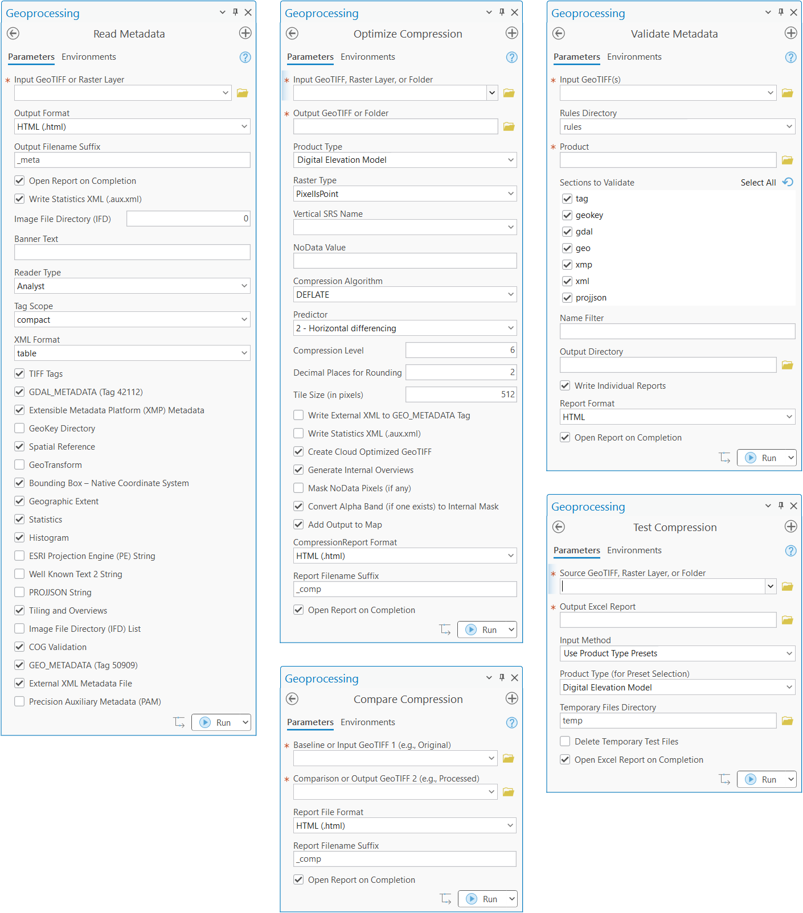

# GeoTIFF ToolKit (GTTK): GeoTIFF Analysis and Optimization Tools

<p align="left">
  
  
</p>

A Python toolkit for analyzing, optimizing, and compressing GeoTIFF files. GTTK provides a modular command-line interface (`gttk`) with five core tools designed for professional geospatial workflows, while an ArcGIS Pro Python toolbox provides Esri software users a convenient way to run each tool in a GUI while leveraging the full potential of GDAL.

## Table of Contents

- [What is GTTK?](#what-is-gttk)
- [Why Use GTTK?](#why-use-gttk)
- [Installation](#installation)
  - [Prerequisites](#prerequisites)
  - [Recommended: Conda Environment](#recommended-conda-environment)
  - [Module Installation](#module-installation)
  - [Key Dependencies](#key-dependencies)
- [Usage Guide](#usage-guide)
  - [The `gttk` Command](#the-gttk-command)
  - [Tool: Compare Compression](#tool-compare-compression-gttk-compare)
  - [Tool: Optimize Compression](#tool-optimize-compression-gttk-optimize)
  - [Tool: Test Compression](#tool-test-compression-gttk-test)
  - [Tool: Read Metadata](#tool-read-metadata-gttk-read)
  - [Tool: Validate Metadata](#tool-validate-metadata-gttk-validate)
- [ArcGIS Pro Toolbox](#arcgis-pro-toolbox)
- [Configuration](#configuration)
- [Advanced Tools: `gttk optimize-arc`](#advanced-tools-gttk-optimize-arc)
- [User Recommendations & Best Practices](#user-recommendations--best-practices)
  - [Compression Best Practices](#compression-best-practices)
  - [LERC Compression Warning](#️-lerc-compression-warning-for-hydro-conditioned-dems)
  - [Understanding JXL Quality Settings](#understanding-jxl-quality-settings)
- [Testing](#testing)

---

## What is GTTK?

GTTK is a comprehensive suite of tools accessible through a single `gttk` command-line interface or ArcGIS toolbox. It provides five specialized modules:

1. **Compare Compression** (`gttk compare`): Validate compression results with side-by-side analysis
2. **Optimize Compression** (`gttk optimize`): Compress and create Cloud-Optimized GeoTIFFs (COGs) with intelligent defaults
3. **Test Compression** (`gttk test`): Benchmark multiple compression settings to find optimal configurations
4. **Read Metadata** (`gttk read`): Generate detailed metadata reports in HTML or Markdown format
5. **Validate Metadata** (`gttk validate`): Validate GeoTIFF metadata against product-specific rules

All tools feature automated report generation, intelligent data-aware processing, and seamless integration with ArcGIS Pro via the included Python Toolbox.

## Why Use GTTK?

GTTK is more than a compression script—it's an optimization engine that combines multiple best practices into a cohesive, easy-to-use toolkit.

**Solves the Vertical Datum Problem**: For elevation data, GTTK handles compound coordinate systems natively, preventing common errors that can lead to vertical shifts of several meters. Assign vertical datums by name (e.g., `EGM2008`), EPSG code (e.g. `EPSG:5703`), or WKT string.

**Fast and Efficient**: All operations are performed in-memory using GDAL's virtual file system, avoiding intermediate file writes. This significantly improves performance, especially for large files or complex processing chains.

**Expert-Level Automation**: Intelligent, data-aware defaults make optimal choices for you. GTTK automatically selects the right predictor for compression algorithms, chooses appropriate resampling methods, and adapts workflows based on data type.

**Prevents Common Mistakes**: Built-in safeguards prevent errors like assigning the wrong raster type (PixelIsArea vs. PixelIsPoint) or failing to embed the vertical SRS in DEMs. The `compare` tool validates results, and the `test` tool helps you find the perfect balance between file size and performance for your products.

**Benchmarking and Validation**: The `compare` tool validates data integrity after compression. The `test` tool measures file size, compression efficiency, write speed, and read speed across multiple settings, helping you identify optimal configurations.

**Auto-Standardizes Non-Standard CRS**: GeoTIFFs from Esri software often lack EPSG codes. GTTK automatically detects these cases and uses an included Esri-to-EPSG lookup table to ensure better interoperability.

## Installation

### Prerequisites

- **Python 3.12+**
- **GDAL 3.11+**: Required for all geospatial operations

### Recommended: Conda Environment

Using Conda ensures all dependencies (especially GDAL) are properly managed:

```bash
# Create environment from the provided environment.yml
conda env create -f environment.yml

# Activate the environment
conda activate gttk
```

### Module Installation

After activating the environment, install GTTK as a Python module:

```bash
# For development (editable install)
pip install -e .

# For production
pip install .
```

This makes the `gttk` command available system-wide within your Conda environment.

### Key Dependencies

The `environment.yml` includes:

- `python>=3.12`
- `gdal>=3.11`
- `jsonpath-ng`
- `lxml`
- `matplotlib`
- `mistune`
- `numpy`
- `openpyxl`
- `tifffile`
- `psutil`

## Usage Guide

GTTK provides five specialized command-line tools, each designed for a specific workflow in GeoTIFF analysis and optimization. Every tool generates comprehensive reports to document results and validate changes.

The [`example_reports/`](example_reports/) directory contains sample HTML reports demonstrating each tool's output format. These examples are referenced below in the tool descriptions to illustrate real-world applications and results.

### The `gttk` Command

GTTK provides a unified command-line interface with five specialized tools. Use the `--help` flag to see available tools and options:

```bash
# Show all available tools
gttk --help

# Show help for a specific tool
gttk compare --help
gttk optimize --help
gttk test --help
gttk read --help
gttk validate --help
```

### Tool: Compare Compression (`gttk compare`)

#### Description

**Purpose**: Validate compression results by comparing baseline and processed GeoTIFF files.

Compression reports provide side-by-side comparison of baseline (input) and comparison (output) GeoTIFF files, including:

- File size reduction metrics
- Compression algorithm and settings comparison
- Data integrity validation (min/max/mean comparison)
- COG validation comparison
- Metadata changes summary
- Performance implications
- Visual quality assessment guidance

A compression report is also generated each time `gttk optimize` is run, comparing the input and output files to gauge the effectiveness of the optimization and break down the changes in data content and file structure.

#### Command-Line Arguments

| Argument | Short | Type | Required | Default | Description |
| -------- | ----- | ---- | -------- | ------- | ----------- |
| `--input` | `-i` | Path | Yes | - | The baseline (or original) GeoTIFF for comparison |
| `--output` | `-o` | Path | Yes | - | The comparison (or processed) GeoTIFF |
| `--config` | `-c` | str | No | `config.toml` | Path to a custom configuration file |
| `--report-format` | `-f` | str | No | `html` | Output format for the report file (`html` or `md`) |
| `--open-report` | - | bool | No | `True` | Open the report automatically after generation |
| `--verbose` | `-v` | flag | No | `False` | Enable verbose logging |

#### Example Usage

```bash
# Compare original DEM with compressed version
gttk compare -i original_dem.tif -o compressed_dem.tif

# Generate Markdown report instead of HTML
gttk compare -i baseline.tif -o optimized.tif --report-format md
```

---

#### Example Reports

**1. [Pix4DMapper_ebee_ortho_JXL_comp.html](example_reports/Pix4DMapper_ebee_ortho_comp.html)**

**Description**: Pix4DMapper orthomosaic processed from ebee drone imagery

- The original image used LZW compression with an 8-bit alpha band, which is very inefficient for imagery.
- The alpha band used for masking areas outside the mosaic was replaced with a transparency mask that also fixed edge effects while reducing file size.
- YCbCr JPEG compression at quality=90 (visually lossless) reduced the image size by 86% relative to the input LZW compression.
- The input histogram displays the alpha band on a different axis so its bimodal distribution doesn't flatten the RGB bands.

**2. [USGS_1M_11_x33y541_WA_NorthCentral_2021_B21_comp.html](example_reports/USGS_1M_11_x33y541_WA_NorthCentral_2021_B21_comp.html)**

**Description**: A one-meter-resolution DEM produced through the USGS 3D Elevation Program (3DEP) in northern Washington State, available at [this link](https://www.sciencebase.gov/catalog/item/66726a21d34e84915adbb360).

- The source USGS DEM, already a COG with overviews, reduced in size by 49% simply by switching from LZW to DEFLATE, rounding to 1 cm, and using Predictor 2 instead of 3.

### Tool: Optimize Compression (`gttk optimize`)

#### Description

**Purpose**: Create optimized, compressed GeoTIFF files with intelligent defaults and COG compliance.

This powerful tool combines multiple optimization techniques into a single, streamlined workflow:

- **In-memory processing** for maximum performance using GDAL's virtual file system
- **Automatic predictor selection** for optimal lossless compression (LZW/DEFLATE/ZSTD)
- **Native compound CRS handling** for elevation data with vertical datums
- **Alpha-to-mask conversion** for imagery (RGBA → RGB + internal mask)
- **Precision control via rounding** for floating-point data
- **Intelligent data-aware defaults** that adapt to product type
- **Multi-algorithm support**: JPEG, JXL, LZW, DEFLATE, ZSTD, LERC, and uncompressed
- **Lossy and lossless modes** with controlled quality/error thresholds
- **Cloud-Optimized GeoTIFF (COG) creation** with proper internal structure
- **Internal overview generation** with optimized tiling and resampling
- **NoData value remapping** and validation for data type compatibility
- **Custom vertical datum support** (EPSG codes, names, or WKT strings)
- **PixelIsPoint vs PixelIsArea** automatic assignment by product type with override option
- **Metadata preservation and enhancement** including external XML embedding
- **GeoTIFF v1.1 compliance** with WKT2 spatial reference encoding
- **Esri compatibility**: Automatic EPSG code lookup for non-standard CRS
- **Statistics calculation** with optional PAM .aux.xml generation
- **Automated comparison reports** showing before/after compression analysis

#### Command-Line Arguments

| Argument | Short | Type | Required | Default | Description |
| -------- | ----- | ---- | -------- | ------- | ----------- |
| `--input` | `-i` | Path | Yes | - | Input source GeoTIFF file path |
| `--output` | `-o` | Path | Yes | - | Output COG file path |
| `--product-type` | `-t` | str | Yes | - | Type of GeoTIFF product (`dem`, `image`, `error`, `scientific`, `thematic`) |
| `--raster-type` | `-r` | str | No | Auto | Override raster type (`point` for PixelIsPoint, `area` for PixelIsArea) |
| `--algorithm` | `-a` | str | No | Auto | Compression algorithm (`JPEG`, `JXL`, `LZW`, `DEFLATE`, `ZSTD`, `LERC`, `NONE`) |
| `--vertical-srs` | `-s` | str | Varies | - | Vertical SRS for elevation products (required for `dem` type) |
| `--nodata` | `-n` | float | No | - | NoData value |
| `--decimals` | `-d` | int or `none` | No | Auto | Decimal places to round DEM/error/scientific data, or `none` to keep full precision |
| `--predictor` | `-p` | int | No | Auto | Predictor for LZW/DEFLATE/ZSTD compression (1, 2, or 3) |
| `--max-z-error` | `-z` | float | No | Auto | Max Z error for LERC compression |
| `--level` | `-l` | int | No | Auto | Compression level for DEFLATE or ZSTD |
| `--quality` | `-q` | int | No | `90` | JPEG/JXL quality (75-100) for image products |
| `--geo-metadata` | `-g` | bool | No | `False` | Write external XML metadata to the GEO_METADATA tag |
| `--write-pam-xml` | `-w` | bool | No | `True` | Write an Esri-compatible .aux.xml PAM statistics file |
| `--tile-size` | - | int | No | `512` | Tile size in pixels for primary layer and overviews |
| `--mask-alpha` | - | bool | No | `True` | Convert alpha band to internal mask (RGB+mask) vs. preserve RGBA |
| `--mask-nodata` | - | bool | No | Auto | Add NoData pixels to transparency mask |
| `--cog` | - | bool | No | `True` | Create a Cloud Optimized GeoTIFF |
| `--overviews` | - | bool | No | `True` | Generate internal overviews |
| `--overview-resampling` | - | str | No | Auto | Resampling kernel for overviews (`NEAREST`, `AVERAGE`, `BILINEAR`, `CUBIC`, `CUBICSPLINE`, `LANCZOS`, `MODE`, `RMS`, `GAUSS`). Default: `NEAREST` for `thematic`/`image`, `BILINEAR` otherwise |
| `--overview-compress` | - | str | No | `--algorithm` | Compression for overviews |
| `--overview-predictor` | - | int | No | `--predictor` | Predictor for overviews |
| `--num-threads` | - | str | No | `ALL_CPUS` | Worker threads for compression; lower it when running several `gttk` processes at once |
| `--report` | - | bool | No | `True` | Generate the before/after comparison report. Set `False` for batch runs |
| `--report-format` | `-f` | str | No | `html` | Output format for the report file (`html` or `md`) |
| `--report-suffix` | - | str | No | `_comp` | Suffix for the report filename |
| `--open-report` | - | bool | No | `True` | Open the report automatically after generation |
| `--verbose` | `-v` | flag | No | `False` | Enable verbose logging |

#### Example Usage

```bash
# Compress a DEM with ZSTD, rounding to 2 decimal places
gttk optimize -i source_dem.tif -o output_dem.tif -t dem -a ZSTD \
  -s EGM2008 --decimals 2

# Compress an orthomosaic with JPEG
gttk optimize -i ortho.tif -o ortho_compressed.tif -t image -a JPEG -q 90

# Compress a thematic raster with DEFLATE
gttk optimize -i landcover.tif -o landcover_cog.tif -t thematic -a DEFLATE --nodata 0

# High-precision compression with LERC (1 cm max error for elevation in meters)
gttk optimize -i scientific.tif -o scientific_lerc.tif -t scientific -a LERC \
  --max-z-error 0.01
```

#### Example Reports

**1. [INEGI_f13a35e4_ms_comp.html](example_reports/INEGI_f13a35e4_ms_comp.html)**

**Description**: A 1.5m Digital Surface Model (DSM) over Mazatlán, Mexico produced and distributed by the Instituto Nacional de Estadística y Geografía (INEGI) on their [portal](https://www.inegi.org.mx/contenidos/productos/prod_serv/contenidos/espanol/bvinegi/productos/geografia/imagen_cartografica/1_10_000/lidar/1_5m/Superficie/889463844341_t.zip).The producer-grade (`--reader-type=producer`) [OLD](example_reports/INEGI_f13a35e4_ms_OLD_meta.html) and [NEW](example_reports/INEGI_f13a35e4_ms_NEW_meta.html) metadata reports are provided for context.

- The sidecar XML file packaged with the OLD file was written to the internal GEO_METADATA TIFF Tag (#50909) in the NEW file.
- For comparison, the OLD report shows the XML in `text` format and the NEW report shows it in `table` format.
- GTTK translated the ISO-8859-1 (Latin-1) character encoding to UTF-8, preserving the special characters.
- The input NoData value (-3.402823466385289e+38) is problematic because it is read as `-inf` by software, causing calculation errors; mapping those pixels to NaN solved the problem.
- The NEW file assigns the vertical datum required by the Geoide Gravimétrico Mexicano 2010 (GGM10), which lacks an EPSG code. Because GeoTIFF only stores EPSG codes in GeoKeys, the full compound CRS is stored in the GDAL metadata item `COMPOUND_CRS_WKT2` so the information is not lost.
- The Esri Projection Engine (PE) String in the OLD header was removed from the NEW header because the 2D Projected CS was replaced with the 3D Compound CRS with GGM10 height.
- Updating from GeoTIFF v1.0 to v1.1 ([OGC GeoTIFF Standard](https://www.ogc.org/standards/geotiff/)) reduced the GeoKey Directory complexity, dropping GeoKey count from 17 to 4 for the *horizontal components* and removing the "User-Defined" `GeographicCSTypeGeoKey`/`ProjectedCSTypeGeoKey` types assigned by Esri for the "Mexico ITRF2008 / UTM zone 13N" projected CRS.
- The `Tiling and Overviews` section includes pyramids in the external `.ovr` file as the only IFD is the main image. (Note: The `.ovr` files are NOT factored into the file size or space savings calculations).

**2. [USGS_ortho_054-083_comp.html](example_reports/USGS_ortho_054-083_comp.html)**

**Description**: 2015 East West Gateway 6-inch, 4-band Orthophotography over the Gateway Arch and downtown St. Louis, Missouri, USA. The analyst-grade (`--reader-type=analyst`) [OLD](example_reports/USGS_ortho_054-083_OLD_meta.html) and [NEW](example_reports/USGS_ortho_054-083_NEW_meta.html) metadata reports are included for context.

- The original image distributed on the [USGS EarthExplorer website](https://earthexplorer.usgs.gov/scene/metadata/full/5e83a2397d63a400/3827956_054083/) is uncompressed.
- JXL compression at quality=90 (visually lossless) reduced the 4-band Color Near-Infrared (CNIR) image size by 88% (8.2x).
- The tiling and overviews were optimized and standardized: 128px (main image) and 64px (overview) tiles were replaced with 512px tiles everywhere.
- This reduced the tile count from 5,716 to 409 (a 93% decrease) and levels from 8 to 5.
- The output image is a valid COG, which is consistent with [earlier efforts](https://www.usgs.gov/news/technical-announcement/usgs-digital-elevation-models-dem-switching-new-distribution-format) by the USGS to distribute more of its content in that format.

---

### Tool: Test Compression (`gttk test`)

#### Description

**Purpose**: Benchmark multiple compression settings to find optimal configurations.

Compression Test reports benchmark multiple compression settings - chosen based on the product type or provided by the user as a custom list - to help identify optimal configurations. These metrics are compared to both the input GeoTIFF and a temporary uncompressed GeoTIFF that serves as a benchmark for performance. Each Excel spreadsheet includes:

- Test parameters for each compression configuration
- File size metrics (original size, compressed size, compression ratio)
- Write performance (speed at which file is written to disk)
- Read performance (speed at which file is loaded into RAM memory)
- Compression efficiency rankings
- Recommended optimal settings

File Size and Compression sections also include a `Delta (%)` column, which is the value relative to the original file. This apples-to-apples comparison helps to determine whether any compression configurations provide a substantial benefit, or the original file is good enough to keep unchanged.

#### Command-Line Arguments

| Argument | Short | Type | Required | Default | Description |
| -------- | ----- | ---- | -------- | ------- | ----------- |
| `--input` | `-i` | Path | Yes | - | Source GeoTIFF file or directory for testing |
| `--output` | `-o` | Path | No | Auto | Path to save the output report table in Excel format (.xlsx) |
| `--csv-params` | `-c` | Path | Excl.¹ | - | Path to CSV file with compression parameters to test |
| `--product-type` | `-t` | str | Excl.¹ | - | Use preset template for product type (`dem`, `image`, `error`, `scientific`, `thematic`) |
| `--temp-dir` | - | Path | No | `temp/` | Directory to store temporary compressed GeoTIFFs |
| `--log-file` | - | Path | No | Auto | Path to a log file for debugging |
| `--delete-test-files` | - | bool | No | `True` | Delete temporary files after the test is complete |
| `--open-report` | - | bool | No | `True` | Open the Excel report automatically after generation |
| `--verbose` | `-v` | flag | No | `False` | Enable verbose logging |

*¹ Mutually exclusive: Either `--csv-params` or `--product-type` must be provided.*

#### Example Usage

```bash
# Test DEM compression with preset DEM template options -
# see: gttk/resources/templates/compression_options_dem.csv
gttk test -i source_dem.tif -t dem

# Test all GeoTIFF files in a directory (assumes all are valid image products)
# see: gttk/resources/templates/compression_options_image.csv
gttk test -i input_directory/ -t image

# Test with custom CSV parameters
gttk test -i ortho.tif -c custom_params.csv
```

#### Example Reports

**1. [Pix4DMapper_ebee_ortho_test.xlsx](example_reports/Pix4DMapper_ebee_ortho_test.xlsx)**

**Description**: Pix4DMapper orthomosaic processed from ebee drone imagery

- Removing the predictor (1=None) reduced the compression by 20%.
- DEFLATE and ZSTD increase efficiency ~20%, but the lossless predictive algorithms don't come close to JPEG and JXL!
- Visually lossless (Quality=90) JPEG with YCbCr colorspace is 85.5% more efficient than LZW (92.4% total).
- Visually lossless JXL is 89.1% more efficient than LZW (95.5% total).
- True JXL lossless is still twice as efficient as LZW (80.7% total).
- In this example, JXL is ~25% more efficient than JPEG with fewer visual artifacts but significantly lower read speed.

**2. [USGS_1M_11_x33y541_WA_NorthCentral_2021_B21_test.xlsx](example_reports/USGS_1M_11_x33y541_WA_NorthCentral_2021_B21_test.xlsx)**

**Description**: A one-meter-resolution DEM produced through the USGS 3D Elevation Program (3DEP) in northern Washington State, available at [this link](https://www.sciencebase.gov/catalog/item/66726a21d34e84915adbb360).

- Changing from LZW (the input algorithm) to DEFLATE reduced file size by ~20%.
- Changing Predictor from 3 (Floating-point) to 2 (Horizontal differencing) after rounding to 1 cm reduced it by another ~20%.
- Using Predictor 2 *without* rounding increased file size by ~10%, indicating Predictor 3 is better for full-precision data.
- ZSTD is ~3% more efficient than DEFLATE and loads faster into memory.
- Lossless LERC (Max Z Error = 0) achieves only ~5% compression, making it the least efficient algorithm.
- Controlled lossly LERC with 1 cm precision (Max Z Error = 0.01) achieves the highest compression at ~75% (55% improvement over unrounded LZW).
- While DEFLATE is slower to read/write, this difference has no performance impact in GIS browsers with tiled COGs as each tile loads in milliseconds on modern processors.

---

### Tool: Read Metadata (`gttk read`)

#### Description

**Purpose**: Extract and display comprehensive metadata from GeoTIFF files.

Metadata reports provide comprehensive information about a single GeoTIFF file, including:

- File overview (size, dates, compression efficiency, and transparency type)
- "Compact" (essential) or "Complete" (everything) TIFF tag listing with numeric values and text descriptions
- Embedded XML metadata (formatted or syntax-highlighted)
- GeoKeys (projection, datum, ellipsoid, raster type, etc.)
- Spatial Reference (a readable summmary of the projection information for analysts)
- Spatial Extent rendered in Bounding Box, GeoTransform and Geographic Extent sections
- Syntax-highlighted Well Known Text 2 (WKT2) and PROJJSON strings
- Band statistics and histograms
- Tables with detailed Tiling and Overview breakdowns
- Table listing Image File Directory (IFD) properties including transparency mask and overviews with compression details
- COG validation status
- Internal and external XML metadata as a syntax-highlighted XML string or table

#### Command-Line Arguments

| Argument | Short | Type | Required | Default | Description |
| -------- | ----- | ---- | -------- | ------- | ----------- |
| `--input` | `-i` | Path | Yes | - | Path to the input GeoTIFF file |
| `--page` | `-p` | int | No | `0` | Image File Directory (IFD) page to read |
| `--banner` | `-b` | str | No | - | Text for a banner at the top/bottom of report (e.g., classification) |
| `--reader-type` | `-r` | str | Excl.¹ | `producer` | Target reader type (`analyst` or `producer`) |
| `--sections` | `-s` | str[] | Excl.¹ | - | Specific metadata sections to include in the report |
| `--xml-type` | `-x` | str | No | `table` | Present metadata as `table` or syntax-highlighted `text` |
| `--tag-scope` | `-t` | str | No | `complete` | Level of detail for TIFF tags (`complete` or `compact`) |
| `--write-pam-xml` | `-w` | bool | No | `False` | Write an Esri-compatible .aux.xml PAM statistics file |
| `--report-format` | `-f` | str | No | `html` | Format for the output report (`html` or `md`) |
| `--report-suffix` | - | str | No | `_meta` | Suffix to append to the output report filename |
| `--open-report` | - | bool | No | `True` | Open the report automatically after generation |
| `--verbose` | `-v` | flag | No | `False` | Enable verbose logging |

*¹ Mutually exclusive: If `--sections` is not provided, defaults to use `--reader-type`.*

#### Example Usage

```bash
# Generate comprehensive metadata report
gttk read -i example.tif

# Generate compact report for analysts
gttk read -i example.tif --reader-type analyst --tag-scope compact

# Generate Markdown report with custom banner
gttk read -i classified.tif --report-format md --banner "UNCLASSIFIED"
```

#### Example Reports

**1. [ASTER_PCA_bands1-9_meta.html](example_reports/ASTER_PCA_bands1-9_meta.html)**

**Description**: A multi-band Principal Component Analysis (PCA) over the Gobi Desert in Mongolia, constructed from all 9 VNIR and SWIR bands of the Advanced Spaceborne Thermal Emission & Reflectance Radiometer (ASTER) satellite. Raw data are from [AST_07XT_00404082004040535_20250325113927](s3://lp-prod-protected/AST_07XT.004/AST_07XT_00404082004040535_20250325113927/AST_07XT_00404082004040535_20250325113927.cmr.json).

- Synchronizes font and patch colors between band-specific GDAL metadata, Statistics columns and Histogram chart.
- Displays a layered histogram with all bands in one chart for contrast and to reduce real estate.
- Main "image" rounded to 3 decimals to preserve calculation precision, warranting use of Predictor 3.
- Overviews are NOT rounded because GDAL doesn't support rounding of masked overviews.

**2. [us_nga_egm08_1_meta.html](example_reports/us_nga_egm08_1_meta.html)**

**Description**: The Earth Gravitational Model of 2008 (EGM2008) at 1 arc minute resolution. EGM2008 is a product of the U.S. National Geospatial-Intelligence Agency (NGA) [Office of Geomatics](https://earth-info.nga.mil/).

- Reports the essential metadata required for the [Geodetic TIFF Grid (GTG)](https://proj.org/en/stable/specifications/geodetictiffgrids.html) specification used by PROJ.
- Uses Spatial Reference, Bounding Box, and WKT sections to describe the 3D Geographic WGS 84 CRS (`EPSG:4979`)
- Confirms that the EGM is a COG - a critical requirement for a GTG, supporting near-instant retrieval of geoid height anywhere in the world.

---

### Tool: Validate Metadata (`gttk validate`)

#### Description

**Purpose**: Validate GeoTIFF metadata against user-defined rules for quality assurance and compliance checking.

The Validate Metadata tool enables automated validation of GeoTIFF files against product-specific requirements, supporting:

- **TIFF Tag validation**: Verify bit depth, compression, sample format, and other core metadata
- **GeoKey validation**: Check spatial reference parameters (CRS codes, raster type, datum)
- **GDAL Metadata validation**: Validate statistics, area/point designation, and custom metadata
- **XML Metadata validation**: Validate embedded (GEO_METADATA, XMP) or external XML using XPath
- **PROJJSON validation**: Validate coordinate reference system definitions using JSONPath
- **Extended data types**: Validate date, datetime, URL, and email formats
- **Batch processing**: Validate entire directories with filename pattern filtering

Rules are defined in TOML format and organized by data product (e.g., 3DEP, NAIP, GLO-30). See [`gttk/utils/validation/README.md`](gttk/utils/validation/README.md) for comprehensive documentation on creating validation rules.

#### Command-Line Arguments

| Argument | Short | Type | Required | Default | Description |
| -------- | ----- | ---- | -------- | ------- | ----------- |
| `--input` | `-i` | Path | Yes | - | Input GeoTIFF file or directory to validate |
| `--product` | `-p` | str | Yes | - | Product name to validate against (must exist in rules file) |
| `--rules-dir` | `-r` | Path | No | `gttk/resources/rules` | Directory containing TOML validation rule files |
| `--sections` | `-s` | str[] | No | All | Specific sections to validate (e.g., `tag geokey gdal`) |
| `--name-filter` | `-n` | str | No | - | Filter files by name substring (directory mode only) |
| `--output-dir` | `-o` | Path | No | Auto | Parent directory for validation output folder |
| `--write-reports` | `-w` | bool | No | `True` | Write individual HTML/MD reports for each file |
| `--report-format` | `-f` | str | No | `html` | Output format for individual reports (`html` or `md`) |
| `--open-report` | - | bool | No | `True` | Open the JSON results file after generation |
| `--verbose` | `-v` | flag | No | `False` | Enable verbose logging |

#### Output Structure

When validation completes, GTTK creates an output folder containing:

- **`validation_results.json`**: Complete validation results with file metadata, statistics, and rule outcomes
- **`validation_map.gpkg`**: GeoPackage with file footprints and validation status for GIS visualization
- **Individual reports** (if `--write-reports` is enabled): HTML or Markdown reports with `_PASS` or `_FAIL` suffix

The output folder is named `{input_basename}_validation/` and placed alongside the input by default, or in the directory specified by `--output-dir`.

#### Example Usage

```bash
# Validate a single file against DGED5 product rules
gttk validate -i elevation.tif -p DGED5

# Validate all files in a directory
gttk validate -i /data/dems/ -p 3DEP

# Filter files by name substring (directory mode)
gttk validate -i /data/ -p NAIP --name-filter "ortho"

# Use custom rules directory and specify output location
gttk validate -i input.tif -p GLO-30 -r /path/to/rules/ -o /reports/

# Generate Markdown reports instead of HTML
gttk validate -i input.tif -p 3DEP --report-format md

# Validate specific sections only
gttk validate -i input.tif -p DGED5 -s tag geokey gdal
```

#### Example Reports

<!-- TODO: Add example report links here -->

---

## ArcGIS Pro Toolbox

The GTTK ArcGIS Pro Toolbox stored in `toolbox/GTTK_Toolbox.pyt` provides a complete GUI interface for GIS analysts who prefer point-and-click workflows over command-line interfaces. The toolbox abstracts the complexity of 20+ command-line arguments into intuitive, validated parameter dialogs with smart defaults and dynamic updates.

**Key Benefits**:

- **Visual parameter selection** with validation and helpful descriptions
- **Dynamic UI updates** that adjust available options based on product type and algorithm
- **Integrated with ArcGIS workflows** - add outputs directly to maps
- **Automatic report generation** with options to open results immediately
- **Five complete tools** matching all CLI capabilities

<p align="center">
  
  <br>
  <em>The Optimize Compression tool showing intelligent parameter organization and dynamic updates</em>
</p>

**Quick Start for Existing QGIS/OSGeo4W Users**: If you already have QGIS installed, you likely have OSGeo4W configured. Look for "OSGeo4W Shell" in your Windows Start menu to confirm.

### Setup Requirements

The ArcGIS Pro Toolbox requires:
1. **OSGeo4W with GDAL** - A standalone GDAL environment isolated from ArcGIS Pro's internal GDAL
2. **Python environment with tifffile** - A cloned ArcGIS Pro conda environment with the `tifffile` package installed

For detailed installation and configuration instructions, see the **[Toolbox Setup Guide](toolbox/README.md)**.

---

## Configuration

GTTK uses a `config.toml` file for system-specific settings. This is primarily relevant for ArcGIS Pro Toolbox users who need to configure the OSGeo4W path.

### Key Settings

```toml
[paths]
# Path to OSGeo4W installation (required for ArcGIS Toolbox)
osgeo4w = "C:/OSGeo4W"

[logging]
# Logging Configuration
level = "INFO"
file = "gttk.log"
```

### When to Edit

- **ArcGIS Pro Users**: Update `osgeo4w` path in `config.toml` to match your OSGeo4W installation
- **CLI Users**: Generally no configuration needed; all settings can be passed as command-line arguments
- **Batch Processing**: Customize defaults in `config.toml` to streamline repetitive tasks

**Location**: `config.toml` in the project root directory

---

## Advanced Tools: `gttk optimize-arc`

### Overview

`gttk optimize-arc` is a specialized variant of the `gttk optimize` command designed for environments that require GDAL command-line utilities instead of Python API bindings. While primarily used by the ArcGIS Pro Toolbox, it's also available as a standalone CLI tool.

### Key Differences from `gttk optimize`

| Feature | `gttk optimize` | `gttk optimize-arc` |
| ------- | --------------- | ------------------- |
| **Execution Method** | GDAL Python API (in-memory) | GDAL CLI utilities (subprocess) |
| **Performance** | Faster (no subprocess overhead) | Slightly slower (subprocess calls) |
| **ArcGIS Compatibility** | Limited (ArcGIS GDAL conflicts) | Full (isolated environment) |
| **Command Logging** | Not available | Logs all GDAL commands executed |
| **Use Case** | General CLI use, batch scripts | ArcGIS Toolbox, debugging GDAL workflows |

### Why Use `gttk optimize-arc`?

1. **ArcGIS Pro Integration**: Required for the ArcGIS Toolbox to work correctly
2. **Command Logging**: Generates a log of all GDAL commands for debugging or learning
3. **Developer Tool**: Understand the GDAL workflow by examining logged commands
4. **Reproducibility**: Commands can be extracted and run independently

### Usage

The command-line interface is identical to `gttk optimize`:

```bash
# Standard usage - identical to gttk optimize
gttk optimize-arc -i input.tif -o output.tif -t dem -a ZSTD -s EGM2008 --decimals 2

# Batch processing
gttk optimize-arc -i input_dir/ -o output_dir/ -t image -a JPEG -q 90
```

### Command Log Output

When using `gttk optimize-arc`, all GDAL commands are logged. Example output:

```text
GDAL commands staged. Total commands: 4
---------------------------------------

> gdal_calc.py --calc numpy.where(A == -3.4028235e+38, numpy.nan, A) -A C:/code/GeoTiffToolKit/input/INEGI/889463844341_t/conjunto_de_datos/f13a35e4_ms.tif --outfile C:/Users/john/AppData/Local/Temp/gttk_569d65857c3a46689d9b19a45fd4e121/nodata_remapped.tif --type Float32

> gdal_calc.py --calc round(A, 2) -A C:/Users/john/AppData/Local/Temp/gttk_569d65857c3a46689d9b19a45fd4e121/nodata_remapped.tif --outfile C:/Users/john/AppData/Local/Temp/gttk_569d65857c3a46689d9b19a4

> gdal_calc.py --calc round(A, 2) -A C:/Users/john/AppData/Local/Temp/gttk_569d65857c3a46689d9b19a45fd4e121/nodata_remapped.tif --outfile C:/Users/john/AppData/Local/Temp/gttk_569d65857c3a46689d9b19a45fd4e121/rounded.tif --overwrite --type Float32

> gdal_translate --config OSR_WKT_FORMAT WKT2_2019 --config GTIFF_WRITE_SRS_WKT2 YES --config GTIFF_SRS_SOURCE WKT -of GTiff -co TILED=YES -mo AREA_OR_POINT=Area -mo TIFFTAG_SOFTWARE=GeoTIFF ToolKit v0.8.0 -mo AREA_OR_POINT=Point -a_nodata nan C:/Users/john/AppData/Local/Temp/gttk_569d65857c3a46689d9b19a45fd4e121/rounded.tif C:/Users/john/AppData/Local/Temp/gttk_569d65857c3a46689d9b19a45fd4e121/preprocessed.tif

> python C:/Users/john/AppData/Local/Temp/gttk_569d65857c3a46689d9b19a45fd4e121/run_translate.py    

---------------------------------------
```

### Technical Details

- **Isolated Environment**: Executes in OSGeo4W environment via `gdal_runner.py`
- **Temporary Files**: Uses disk-based temporary files (vs in-memory for `gttk optimize`)
- **Output Reports**: Generates identical comparison reports to `gttk optimize`

### When to Use Each Tool

- **Use `gttk optimize`** (standard):
  - CLI workflows outside ArcGIS Pro
  - Best performance for large files
  - Python scripting integration
  
- **Use `gttk optimize-arc`**:
  - ArcGIS Pro Toolbox (automatic)
  - Debugging GDAL workflows
  - Learning GDAL command patterns
  - Need reproducible command logs

---

## User Recommendations & Best Practices

### Compression Best Practices

Modern datasets are increasingly large, and cloud storage costs are directly proportional to data volume. This section provides practical guidance for optimizing GeoTIFF compression using GTTK.

#### General Best Practices

1. **Avoid External Compression**: Never zip GeoTIFF files. Software cannot read files inside compressed archives, and Cloud Optimized GeoTIFFs (COGs) cannot be streamed via HTTP when containerized.

2. **Quality Checks**: Always perform quality checks before and after compression using `gttk compare` to ensure data integrity.

3. **Visual Inspection**: When using lossy compression (JPEG, JXL, or lossy LERC), conduct visual inspections to verify quality requirements are met.

4. **Documentation**: Document all compression settings and processes in metadata and accompanying reports (GTTK does this automatically in comparison reports).

5. **Test First**: Use `gttk test` to determine optimal compression settings for your specific data types and use cases before processing large datasets.

6. **Consistency**: For time-series or multi-temporal datasets, use consistent compression approaches across all files to maintain comparability.

7. **Clear Distribution Info**: When distributing data, provide information about compression methods used (GTTK reports include this automatically).

#### Algorithm Selection Guide

**For Multi-Band Imagery:**

- **Primary Choice**: JPEG with `--quality=90` for photographic/satellite imagery
- **Alternative**: JXL with `--quality=90` for better compression (~25% better than JPEG), 16-bit imagery and modern codec support
- **Considerations**:
  - Use `--mask-alpha=True` (default) to convert RGBA to RGB+mask
  - Use `--mask-nodata=True` (default) for imagery with NoData values
  - YCbCr color space is automatically applied by GTTK for JPEG

**For Elevation and Scientific Data:**

*DEFLATE (Zip):*

```bash
gttk optimize -i input.tif -o output.tif -t dem -a DEFLATE -s EPSG:5703 --predictor=3
```

- **Strengths**: Good compression, widely supported, stable
- **Weaknesses**: Slower than LZW/ZSTD, less efficient than ZSTD/LERC
- **Use Case**: General-purpose lossless compression with broad compatibility (the default)

*LZW (Lempel-Ziv-Welch):*

```bash
gttk optimize -i input.tif -o output.tif -t dem -a LZW -s EPSG:5703 --predictor=2
```

- **Strengths**: Lossless, widely supported, predictable performance
- **Weaknesses**: Less efficient than DEFLATE/ZSTD, slower than ZSTD
- **Use Case**: Legacy software compatibility required

*ZSTD (ZStandard):*

```bash
gttk optimize -i input.tif -o output.tif -t dem -a ZSTD -s EPSG:5703 --predictor=3
```

- **Strengths**: Excellent compression, very fast, flexible compression levels (1-22)
- **Weaknesses**: May not be supported in legacy software
- **Use Case**: Recommended for elevation/scientific data when software supports it

*LERC (Limited Error Raster Compression):*

```bash
# Lossless
gttk optimize -i input.tif -o output.tif -t dem -a LERC -s EPSG:5703

# Near-lossless (1 cm max error for elevation in meters)
gttk optimize -i input.tif -o output.tif -t dem -a LERC -s EPSG:5703 --max-z-error=0.01
```

- **Strengths**: Excellent compression for floating-point data, quantifiable error tolerance
- **Weaknesses**: Not supported in all legacy software, not optimal for integer data
- **Use Case**: Floating-point scientific data where controlled precision loss is acceptable
- **⚠️ Warning**: See section below regarding hydro-conditioned DEMs

#### Predictor Optimization (LZW, DEFLATE, ZSTD)

GTTK automatically selects optimal predictors, but you can override:

- **Predictor 1 (None)**: Data compressed as-is. Generally suboptimal for most geospatial data, with the exception of thematic data.
- **Predictor 2 (Horizontal Differencing)**: Highly effective for integer data and smooth or rounded floating-point data. GTTK's default for DEM and Error Models with rounding to 1 or 2 decimals.
- **Predictor 3 (Floating-Point)**: Designed for floating-point data. Best for unrounded floating-point data with high variability (noise).

**Recommendation**: Use `gttk test` to compare Predictor 2 vs. 3 for your specific floating-point datasets.

#### Overview Resampling (and why categorical data needs `NEAREST`)

Overviews are generated by resampling, and most kernels *blend* neighbouring pixels. That is right
for a continuous surface and wrong for a categorical one: averaging class code `2` with class code
`4` produces `3`, a code that means something entirely different and was never in the data. On a
land-cover raster you get invented classes; on a provenance mask you get invented sources.

GTTK picks the kernel from `--product-type` — `NEAREST` for `thematic` and `image`, `BILINEAR` for
`dem`, `error` and `scientific` — and refuses an interpolating kernel on a `thematic` product. This
matters because GDAL's COG driver defaults to `CUBIC` for any band without a colour table, so the
safe choice has to be stated rather than assumed:

```bash
# Categorical: class codes are preserved exactly at every pyramid level
gttk optimize -i landcover.tif -o landcover_cog.tif -t thematic -a ZSTD

# MODE is also safe for categorical data, and often looks better when zoomed out
gttk optimize -i landcover.tif -o landcover_cog.tif -t thematic -a ZSTD --overview-resampling MODE
```

Overviews also inherit `--algorithm` unless `--overview-compress` says otherwise; without that the
COG driver would write LZW pyramids inside a ZSTD file.

#### Batch Runs

Two options matter when scripting over many files:

- `--report False` skips report generation. Each report costs two full metadata passes, a complete
  COG validation of both files and a histogram render, which is worth it for one file and
  prohibitive for thousands.
- `--num-threads N` caps the compression threads per file. The default `ALL_CPUS` is right for a
  single run and oversubscribes badly when you run several `gttk` processes in parallel.

Directory input never auto-opens reports, whatever `--open-report` says.

#### Rounding for Improved Compression

For floating-point elevation data, rounding to a sensible precision can significantly improve
compression efficiency. `--decimals` accepts a non-negative integer, or `none` to disable rounding
and preserve the source values exactly:

```bash
# Round DEM to 2 decimal places (1 cm precision)
gttk optimize -i input.tif -o output.tif -t dem -a ZSTD -s EPSG:5703 --decimals=2 --predictor=2

# Round error model more aggressively (1 decimal = 10 cm precision)
gttk optimize -i error.tif -o error_compressed.tif -t error -a DEFLATE --decimals=1 --predictor=2

# Keep full precision -- no rounding (the default for the `scientific` type)
gttk optimize -i data.tif -o data_compressed.tif -t scientific -a ZSTD --decimals=none
```

**Benefits of Rounding:**

- Removes pseudo-precision beyond sensor/software accuracy
- Increases data repetition, improving dictionary-based compression (LZW/DEFLATE/ZSTD)
- Creates more identical adjacent values in smooth terrain
- Results in cleaner, easier-to-read data queries

**Guidelines (defaults in parentheses):**

- DEM data: 2 decimal places, ~1 cm precision (default)
- Error models: 1 decimal place, ~10 cm precision (default)
- Scientific data: `none` — keep full precision (default)
- Bathymetry: Match the precision of your sonar equipment
- Document rounding or decimal precision in metadata (GTTK does this automatically)

> **Float32 precision caveat:** a 32-bit float holds only ~7 significant digits, so at elevation
> magnitudes it can resolve roughly 3–5 decimal places (fewer at higher elevations). Requesting more
> decimals than the data type can represent does nothing useful — GTTK treats it as `none` and logs a
> notice. Prefer `--decimals none` to say "keep full precision" explicitly rather than passing an
> arbitrarily large number (e.g. `--decimals 8`), which used to add noise and bloat the file.

#### Cloud Optimized GeoTIFF (COG) Settings

GTTK creates COGs by default (`--cog=True`). Key parameters:

- **Tile Size**: Default 512×512 pixels (`--tile-size=512`). Recommended: 256 for web mapping, 1024 for very large images or processing workflows.
- **Overviews**: Enabled by default (`--overviews=True`). Required for efficient visualization and web streaming.
- **Internal Structure**: GTTK automatically creates proper internal tiling and overview structure for COG compliance.

**Validation**: GTTK automatically validates COG structure and reports compliance in comparison reports.

### ⚠️ LERC Compression Warning for Hydro-Conditioned DEMs

While **lossy** LERC (Limited Error Raster Compression) is highly efficient and allows for controlled near-lossless compression, **it is not suitable for hydro-conditioned Digital Elevation Models (DEMs)** used in hydrologic modeling software.

**Why This Matters:**

- Hydrologic models rely on precise stream elevations and flow directions
- Even a small elevation change (e.g., 1 cm) can alter stream flow direction or create artificial sinks
- This primarily impacts smaller drainages with monotonic stream increments given the 8x8 pixel LERC block size
- The effect cannot be ruled out entirely for any hydro-conditioned dataset

**Recommendations:**

- For hydro-conditioned DEMs: Use **lossless LERC** (`--max-z-error=0`) or lossless algorithms like DEFLATE, ZSTD, or LZW (note: lossless LERC is the **least** efficient algorithm)
- For general-purpose terrain models, error models and scientific data: Lossy LERC with appropriate `--max-z-error` values is acceptable
- When in doubt, use `gttk test` to benchmark different settings and validate results with `gttk compare`

### Understanding JXL Quality Settings

The `--quality` argument for JPEG XL (JXL) compression bridges the gap between the scientific, psychovisual parameters of modern codecs and the familiar "Quality 0-100" scale from legacy JPEG.

**JXL Algorithm Parameters:**

The JXL codec uses three key parameters that GTTK manages automatically based on your `--quality` setting:

1. **JXL_DISTANCE**: Controls perceptual image quality based on the Butteraugli score, a psychovisual metric where 1.0 equals one "Just Noticeable Difference" (JND).
2. **JXL_ALPHA_DISTANCE**: Controls alpha channel compression. Hardcoded to `-1` to match the `JXL_DISTANCE` value, ensuring the alpha channel degrades at the same rate as RGB channels, preventing "halos" around masked objects. This is optimal for data with strict masks (0 or 255 values).
3. **JXL_EFFORT**: Controls encoding speed vs. file size balance. Hardcoded to `7` to provide the best balance between encoding speed and file compression density.

**Quality to Distance Mapping: "The Rule of Ten"**
GTTK uses a linear formula to convert your intuitive quality setting into JXL_DISTANCE:

```python
distance = (100 - quality) × 0.1
```

**Implementation Table:**

| Quality | Logic | JXL_LOSSLESS | JXL_DISTANCE | Result Description |
| ------- | ----- | ------------ | ------------ | ----------------- |
| 100 | Perfect | YES | N/A | Mathematically lossless. Pixel-for-pixel identical. |
| 95-99 | High | NO | 0.1 - 0.5 | Near-lossless. Artifacts statistically present but invisible to the human eye. |
| 90 | Standard | NO | 1.0 | **Visually lossless** (the "sweet spot"). Artifacts at the threshold of human perception (1 JND). |
| 80-89 | Med-High | NO | 1.1 - 2.0 | High quality. Artifacts may be visible upon zooming/diffing, but image looks clear. |
| 75 | Medium | NO | 2.5 | Web quality. Comparable to standard JPEG q75. Great compression, acceptable artifacts. |

**Recommendation**: For most imagery, use `--quality=90` (the default) for visually lossless results with excellent compression.

---

## Testing

GTTK includes a comprehensive test suite with **936 tests** covering unit, integration, end-to-end, and validation scenarios. The testing infrastructure ensures code quality, reliability, and maintainability for professional use in enterprise and government environments.

### Test Suite Overview

| Category | Test Count | Percentage | Description |
| -------- | --------- | ---------- | ----------- |
| **Unit Tests** | 832 | 89% | Isolated component tests |
| **Integration Tests** | 51 | 5% | Component interaction tests |
| **E2E Tests** | 53 | 6% | Full CLI workflow tests |
| **TOTAL** | **936** | **100%** | |

**Test Coverage Includes:**
- Core tools: Compare, Optimize, Test, Read, Validate
- GeoTIFF processing and metadata extraction
- SRS logic and coordinate reference systems
- Validation engine with all constraint types
- Extended data types (date, datetime, url, email)
- XPath and JSONPath extraction
- Report generation and formatting

### Documentation

For detailed information about testing, including:

- Test organization and structure
- Writing new tests
- Testing fixtures and mock data
- Troubleshooting guide
- Contributing guidelines

see the comprehensive testing documentation:

- **[`tests/README.md`](tests/README.md)**: Complete testing guide for developers
- **[`plans/testing_plan.md`](plans/testing_plan.md)**: Initial testing strategy covering the first 247 tests
- **[`plans/testing_expansion_plan.md`](plans/testing_expansion_plan.md)**: Testing roadmap and Phase 1 completion report

---
