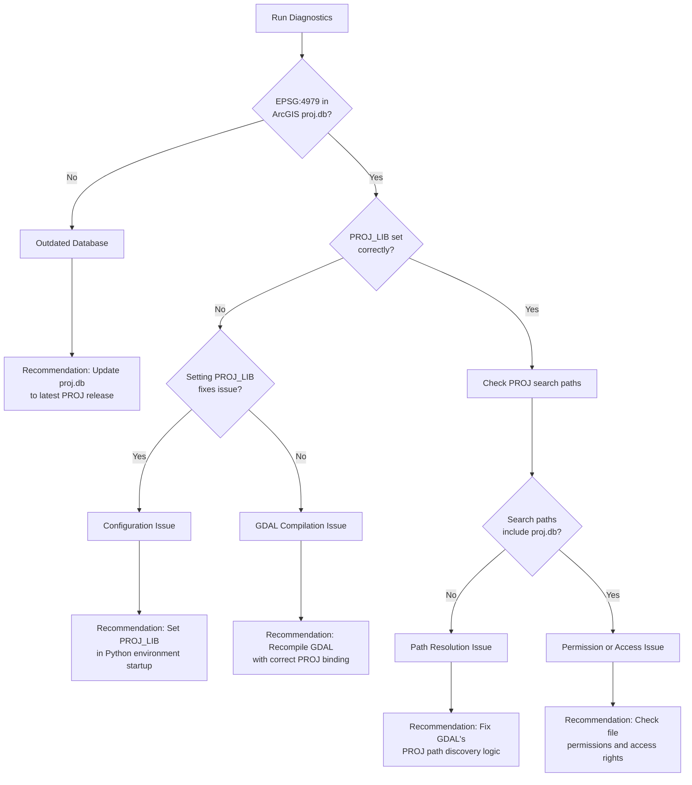

# ArcGIS Pro GDAL/PROJ Configuration Diagnostic Plan

## Executive Summary

This plan investigates why ArcGIS Pro's bundled GDAL fails to recognize modern EPSG codes (e.g., EPSG:4979 - WGS 84 3D) despite having a proj.db file in its installation. The goal is to determine whether this is a simple configuration issue that Esri can fix, or a deeper architectural problem.

## Background

**Problem**: ArcGIS Pro 3.6.0 bundles GDAL 3.11.3 and includes a proj.db file, but GDAL calls from ArcGIS Pro's Python environment fail to recognize modern 3D geographic and compound coordinate reference systems.

**Impact**: This causes `GetSpatialRef()` to return `None` for valid GeoTIFF files with modern CRS, resulting in:
- Missing geospatial metadata sections in reports
- Failed coordinate transformations
- Inability to process scientifically important datasets (e.g., EGM2008 geoid models)

**Current Workarounds**:
1. [`arcgis_proj_config.py`](../gttk/utils/arcgis_proj_config.py:27) - Sets PROJ_LIB to OSGeo4W's proj database
2. [`gdal_runner.py`](../gttk/utils/gdal_runner.py:313) - Spawns isolated subprocess with clean OSGeo4W environment

## Investigation Goals

1. **Verify proj.db Content**: Confirm EPSG:4979 and related codes exist in ArcGIS Pro's proj.db
2. **Identify Configuration Gaps**: Determine if PROJ_LIB/PROJ_DATA environment variables are set correctly
3. **Test Environment Manipulation**: Check if setting PROJ_LIB before GDAL import resolves the issue
4. **Compare Database Versions**: Analyze differences between ArcGIS Pro and OSGeo4W proj.db files
5. **Determine Root Cause**: Establish whether this is fixable via configuration or requires code changes

## Diagnostic Steps

### Step 1: Locate and Verify ArcGIS Pro's proj.db

**Objective**: Find all proj.db files in the ArcGIS Pro installation and verify EPSG:4979 is present.

**Actions**:
```python
import os
from pathlib import Path
import sqlite3

# Typical ArcGIS Pro installation paths
arcgis_paths = [
    Path(os.environ.get('ARCHOME', 'C:/Program Files/ArcGIS/Pro')),
    Path('C:/Program Files/ArcGIS/Pro'),
]

# Search for proj.db files
proj_dbs = []
for base_path in arcgis_paths:
    if base_path.exists():
        proj_dbs.extend(base_path.rglob('proj.db'))

for db_path in proj_dbs:
    print(f"\nFound: {db_path}")
    print(f"Size: {db_path.stat().st_size:,} bytes")
    print(f"Modified: {db_path.stat().st_mtime}")
```

**Expected Locations**:
- `C:/Program Files/ArcGIS/Pro/bin/proj.db`
- `C:/Program Files/ArcGIS/Pro/Resources/pedata/proj.db`
- Other potential locations in the installation hierarchy

### Step 2: Query proj.db for EPSG:4979

**Objective**: Verify the problematic EPSG codes exist in ArcGIS Pro's database.

**SQL Queries**:
```sql
-- Check if EPSG:4979 exists
SELECT * FROM crs_view WHERE auth_name = 'EPSG' AND code = '4979';

-- Check database version and metadata
SELECT * FROM metadata WHERE key = 'PROJ.VERSION';

-- Compare 2D vs 3D geographic CRS availability
SELECT COUNT(*) FROM crs_view 
WHERE auth_name = 'EPSG' 
  AND type = 'geographic 2D';
  
SELECT COUNT(*) FROM crs_view 
WHERE auth_name = 'EPSG' 
  AND type = 'geographic 3D';

-- Check for compound CRS support
SELECT code, name FROM crs_view 
WHERE auth_name = 'EPSG' 
  AND type = 'compound' 
LIMIT 10;
```

**Key Questions**:
- Is EPSG:4979 present in the database?
- Are 3D geographic CRS generally missing or incomplete?
- What PROJ version was used to build this database?

### Step 3: Check GDAL/PROJ Environment Variables

**Objective**: Document the runtime environment when GDAL is loaded in ArcGIS Pro's Python.

**Investigation Script**:
```python
import os
import sys

# Before importing GDAL
print("=== Environment Before GDAL Import ===")
env_vars = [
    'PROJ_LIB', 'PROJ_DATA', 'PROJ_NETWORK',
    'GDAL_DATA', 'GDAL_DRIVER_PATH', 
    'ARCHOME', 'PATH', 'PYTHONPATH'
]

for var in env_vars:
    value = os.environ.get(var, '<NOT SET>')
    print(f"{var}: {value}")

# Import GDAL and check what it sees
from osgeo import gdal, osr

print("\n=== GDAL Configuration ===")
print(f"GDAL Version: {gdal.__version__}")
print(f"GDAL Data Path: {gdal.GetConfigOption('GDAL_DATA')}")
print(f"PROJ Data Path: {osr.GetPROJSearchPaths()}")

# Try to create EPSG:4979
print("\n=== Testing EPSG:4979 ===")
srs = osr.SpatialReference()
result = srs.ImportFromEPSG(4979)
print(f"ImportFromEPSG(4979) result: {result}")  # 0 = success, non-zero = failure
print(f"SRS Valid: {srs.Validate() == 0}")
print(f"Authority: {srs.GetAuthorityName(None)}")
print(f"Code: {srs.GetAuthorityCode(None)}")
```

**Expected Issues**:
- PROJ_LIB may not be set, or points to wrong location
- GDAL may be using a hardcoded fallback path
- PROJ search paths may not include the directory with proj.db

### Step 4: Test Environment Variable Override

**Objective**: Determine if manually setting PROJ_LIB before GDAL import resolves the issue.

**Test Script**:
```python
import os
import sys
from pathlib import Path

# Find ArcGIS Pro's proj.db (from Step 1)
arcgis_proj_db = Path("C:/Program Files/ArcGIS/Pro/bin/proj.db")
if not arcgis_proj_db.exists():
    print("ERROR: proj.db not found at expected location")
    sys.exit(1)

# Set PROJ_LIB BEFORE importing GDAL
os.environ['PROJ_LIB'] = str(arcgis_proj_db.parent)
print(f"Set PROJ_LIB to: {os.environ['PROJ_LIB']}")

# Now import GDAL
from osgeo import osr

# Test EPSG:4979 again
print("\n=== Testing EPSG:4979 with PROJ_LIB override ===")
srs = osr.SpatialReference()
result = srs.ImportFromEPSG(4979)
print(f"ImportFromEPSG(4979) result: {result}")
print(f"SRS Valid: {srs.Validate() == 0}")

if result == 0:
    print("\n✓ SUCCESS: Setting PROJ_LIB fixes the issue!")
    print("  This is a CONFIGURATION PROBLEM that Esri can easily fix.")
else:
    print("\n✗ FAILURE: Setting PROJ_LIB does not fix the issue.")
    print("  This may require deeper investigation into GDAL/PROJ binding.")
```

**Possible Outcomes**:

| Result | Interpretation | Recommendation |
|--------|---------------|----------------|
| **Success** | PROJ_LIB not set by ArcGIS Pro's environment | Esri should set PROJ_LIB in their Python environment initialization |
| **Failure** | GDAL is hardcoded or ignoring PROJ_LIB | Esri needs to recompile GDAL with correct PROJ paths, or fix DLL binding |

### Step 5: Compare proj.db Files

**Objective**: Identify structural or content differences between ArcGIS Pro and OSGeo4W databases.

**Comparison Script**:
```python
import sqlite3
from pathlib import Path

arcgis_db = Path("C:/Program Files/ArcGIS/Pro/bin/proj.db")
osgeo4w_db = Path("C:/OSGeo4W/share/proj/proj.db")

def analyze_db(db_path):
    """Extract key metadata from proj.db"""
    conn = sqlite3.connect(db_path)
    cursor = conn.cursor()
    
    info = {
        'path': str(db_path),
        'size': db_path.stat().st_size,
        'proj_version': None,
        'total_crs': 0,
        'epsg_crs': 0,
        'has_epsg_4979': False,
        'geographic_3d_count': 0,
        'compound_crs_count': 0
    }
    
    # PROJ version
    cursor.execute("SELECT value FROM metadata WHERE key = 'PROJ.VERSION'")
    info['proj_version'] = cursor.fetchone()[0] if cursor.fetchone() else 'Unknown'
    
    # Total CRS count
    cursor.execute("SELECT COUNT(*) FROM crs_view")
    info['total_crs'] = cursor.fetchone()[0]
    
    # EPSG CRS count
    cursor.execute("SELECT COUNT(*) FROM crs_view WHERE auth_name = 'EPSG'")
    info['epsg_crs'] = cursor.fetchone()[0]
    
    # Check for EPSG:4979
    cursor.execute("SELECT COUNT(*) FROM crs_view WHERE auth_name = 'EPSG' AND code = '4979'")
    info['has_epsg_4979'] = cursor.fetchone()[0] > 0
    
    # 3D geographic CRS
    cursor.execute("SELECT COUNT(*) FROM crs_view WHERE auth_name = 'EPSG' AND type = 'geographic 3D'")
    info['geographic_3d_count'] = cursor.fetchone()[0]
    
    # Compound CRS
    cursor.execute("SELECT COUNT(*) FROM crs_view WHERE auth_name = 'EPSG' AND type = 'compound'")
    info['compound_crs_count'] = cursor.fetchone()[0]
    
    conn.close()
    return info

# Analyze both databases
arcgis_info = analyze_db(arcgis_db)
osgeo4w_info = analyze_db(osgeo4w_db)

# Print comparison
print("=== Database Comparison ===\n")
print(f"{'Metric':<30} {'ArcGIS Pro':<20} {'OSGeo4W':<20}")
print("-" * 70)
for key in arcgis_info:
    if key != 'path':
        print(f"{key:<30} {str(arcgis_info[key]):<20} {str(osgeo4w_info[key]):<20}")
```

**Key Insights**:
- If EPSG:4979 is missing from ArcGIS's database → Outdated proj.db
- If present but counts differ significantly → Partial/stripped database
- If identical → Issue is purely in GDAL configuration, not database content

### Step 6: Test with Real GeoTIFF

**Objective**: Document the exact failure mode when opening a problematic file.

**Test Script**:
```python
from osgeo import gdal
import os

# Test file with EPSG:4979
test_file = "path/to/us_nga_egm08_1.tif"

print("=== Opening GeoTIFF with ArcGIS Pro's GDAL ===")
print(f"File: {test_file}")
print(f"PROJ_LIB: {os.environ.get('PROJ_LIB', '<NOT SET>')}")

ds = gdal.Open(test_file)
if ds is None:
    print("✗ GDAL failed to open file")
else:
    print("✓ GDAL opened file successfully")
    
    srs = ds.GetSpatialRef()
    if srs is None:
        print("✗ GetSpatialRef() returned None")
    else:
        print("✓ Got Spatial Reference")
        print(f"  Authority: {srs.GetAuthorityName(None)}")
        print(f"  Code: {srs.GetAuthorityCode(None)}")
        print(f"  WKT Preview: {srs.ExportToWkt()[:200]}...")
    
    ds = None
```

### Step 7: Check for PROJ Network/Grid Files

**Objective**: Determine if missing grid files contribute to the failure.

**Investigation**:
```python
from osgeo import osr
import os

print("=== PROJ Configuration ===")
print(f"PROJ_NETWORK: {os.environ.get('PROJ_NETWORK', '<NOT SET>')}")
print(f"Search Paths: {osr.GetPROJSearchPaths()}")

# Check if network is enabled
srs = osr.SpatialReference()
proj_info = srs.GetPROJInfo()
print(f"PROJ Version: {proj_info}")

# Test transformation that might require grids
source = osr.SpatialReference()
source.ImportFromEPSG(4979)
target = osr.SpatialReference()
target.ImportFromEPSG(4326)

try:
    transform = osr.CoordinateTransformation(source, target)
    print("✓ Coordinate transformation created successfully")
except Exception as e:
    print(f"✗ Coordinate transformation failed: {e}")
```

**Considerations**:
- 3D CRS may require additional datum shift grids
- PROJ network access might be disabled in ArcGIS Pro
- Missing grids could cause CRS recognition to fail entirely

## Decision Matrix

Based on diagnostic results, determine the root cause and recommendation:



## Expected Findings

### Most Likely Scenario
**PROJ_LIB is not set by ArcGIS Pro's Python environment**

- proj.db exists and contains EPSG:4979
- GDAL is correctly compiled and can use proj.db
- BUT: The environment variable is never set, so GDAL can't find the database
- **Fix**: Easy - Esri just needs to set `PROJ_LIB` in their Python initialization

### Alternative Scenarios

1. **Stripped Database**: ArcGIS Pro ships a minimal proj.db without 3D/compound CRS
   - Fix: Include full proj.db or document limitations
   
2. **Hardcoded Paths**: GDAL is compiled with hardcoded PROJ paths that don't exist
   - Fix: Recompile GDAL with runtime path resolution
   
3. **Version Mismatch**: GDAL 3.11.3 incompatible with older proj.db schema
   - Fix: Update proj.db to match GDAL version

## Recommendations for Bug Report

### If Configuration Issue (Most Likely)

**Title**: ArcGIS Pro Python environment does not set PROJ_LIB, causing GDAL to fail on modern CRS

**Description**:
- ArcGIS Pro 3.6.0 bundles GDAL 3.11.3 and includes proj.db with EPSG:4979
- The `PROJ_LIB` environment variable is not set in the Python environment
- This causes GDAL's `ImportFromEPSG()` to fail for 3D and compound CRS
- Setting `PROJ_LIB` manually before importing GDAL resolves the issue

**Proposed Fix**:
Esri should set `PROJ_LIB` in the Python environment initialization scripts (e.g., `sitecustomize.py` or environment activation scripts) to point to the bundled proj database location.

**Severity**: Medium - Workaround exists, but impacts scientific workflows

### If Database Content Issue

**Title**: ArcGIS Pro ships incomplete proj.db lacking modern 3D and compound CRS

**Description**:
- ArcGIS Pro's proj.db is missing or has incomplete definitions for:
  - 3D geographic CRS (e.g., EPSG:4979)
  - Modern compound CRS with custom vertical datums
  - Recent EPSG code additions
  
**Proposed Fix**:
Update to the latest proj.db from PROJ 9.x release, or document CRS limitations in release notes.

**Severity**: High - No easy workaround for end users

### If Compilation Issue

**Title**: ArcGIS Pro's GDAL cannot read proj.db even with correct PROJ_LIB setting

**Description**:
- GDAL appears to be compiled with incorrect PROJ library binding
- Setting PROJ_LIB does not enable CRS recognition
- May be due to static linking or incorrect CMake configuration during build

**Proposed Fix**:
Recompile GDAL with proper PROJ integration, ensuring runtime path resolution works correctly.

**Severity**: High - Requires Esri engineering intervention

## Next Steps

1. **Run Diagnostic Scripts**: Execute all scripts in Steps 1-7
2. **Document Results**: Save outputs to `arcgis_proj_diagnosis_results.txt`
3. **Determine Root Cause**: Use decision matrix to classify the issue
4. **Prepare Bug Report**: Use appropriate template above
5. **Include Evidence**: Attach diagnostic outputs to GitHub issue
6. **Suggest Solution**: Provide concrete, actionable recommendation
7. **Offer Collaboration**: Express willingness to test patches or provide more info

## Success Criteria

The diagnostic investigation is complete when you can answer:

- ✓ Does ArcGIS Pro's proj.db contain EPSG:4979?
- ✓ What environment variables are set when GDAL is imported?
- ✓ Does manually setting PROJ_LIB fix the issue?
- ✓ How do ArcGIS Pro and OSGeo4W proj.db files differ?
- ✓ What is the root cause: configuration, database content, or compilation?
- ✓ Can Esri fix this with a simple config change, or does it require code changes?
- ✓ What concrete recommendation should go in the bug report?
