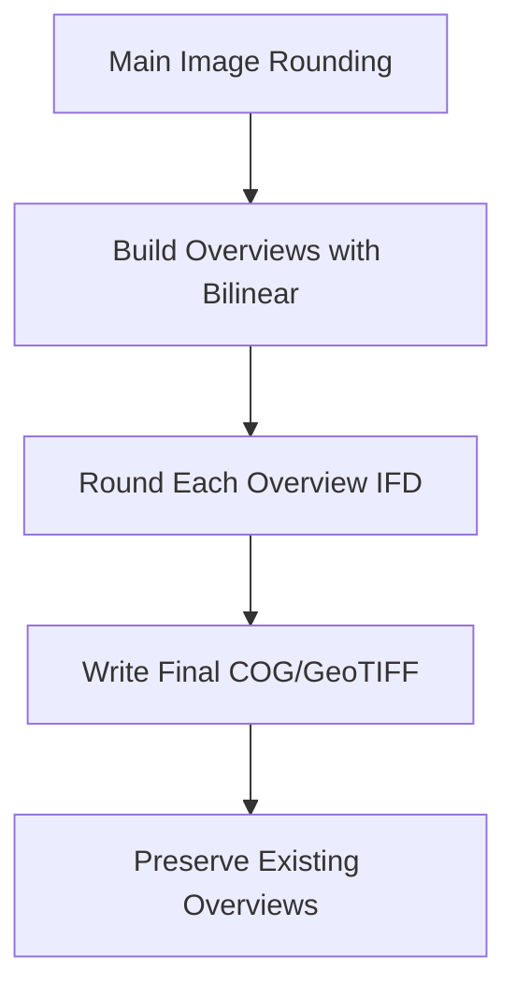

# Overview Rounding - Implementation Plan

## Background

The current implementation rounds the main image of a GeoTIFF when using `--decimals`, which significantly improves compression for DEMs, error models, and scientific data. However, bilinear resampling used for generating overviews introduces non-rounded decimal values, reducing compression efficiency for approximately 25% of the total pixels.

## Problem Statement

**Current Workflow:**

1. Main image is rounded in [`preprocessor.py`](../gttk/utils/preprocessor.py) (lines 278-287)
2. Overviews are generated using bilinear resampling:
   - GeoTIFF: [`BuildOverviews()`](../gttk/tools/optimize_compression.py:285) at line 285
   - COG: Regenerated by COG driver with `OVERVIEWS=IGNORE_EXISTING` at line 211
3. Bilinear resampling creates interpolated values with more decimal places
4. These non-rounded values reduce compression efficiency

**Why This Matters:**

- Compression algorithms (LZW, DEFLATE, ZSTD) rely on repeated patterns
- Rounded values create more repetition → better compression
- Overviews with 1 cm rounding may increase a DEM's space savings by another ~3-6%, assuming an average 20% savings for the full-resolution DEM (typical). For input DEMS that are *already* compressed, this can reduce file size by 10% or more.

## Constraints

1. **COG Validity:** Cloud-Optimized GeoTIFFs cannot be edited after creation - they become invalid
2. **Must Round Before Final Write:** All rounding must happen on the intermediate file
3. **Overview Preservation:** Final output must preserve existing overviews, not regenerate them
4. **Band Support:** Must handle multi-band rasters correctly

## Solution Architecture

### Overview

The solution involves three main components:



### Key Components

1. **Overview Rounding Function** (new in [`preprocessor.py`](../gttk/utils/preprocessor.py))
   - Read each overview band using [`band.GetOverview(i)`](../gttk/utils/geotiff_processor.py:305)
   - Round values using numpy
   - Write back to the same overview band
   - Flush cache to ensure persistence

2. **Workflow Integration** (update in [`optimize_compression.py`](../gttk/tools/optimize_compression.py))
   - Build overviews on intermediate file
   - **NEW:** Round overviews after building them
   - Configure final output to use existing overviews

3. **COG Driver Configuration** (update in [`optimize_compression.py`](../gttk/tools/optimize_compression.py))
   - Change from `OVERVIEWS=IGNORE_EXISTING` to use existing overviews
   - Research correct GDAL option for preserving overviews in COG driver

## Detailed Implementation Steps

### Step 1: Create Overview Rounding Function

**Location:** [`gttk/utils/preprocessor.py`](../gttk/utils/preprocessor.py)

**Function Signature:**

```python
def round_overviews(ds: gdal.Dataset, decimals: int) -> None:
    """
    Round all overview bands in a dataset to specified decimal places.
    
    This function rounds each overview level for all bands to improve compression
    efficiency when using lossless compression algorithms (LZW, DEFLATE, ZSTD).
    
    Args:
        ds: GDAL dataset with existing overviews
        decimals: Number of decimal places to round to
    
    Returns:
        None (modifies dataset in place)
    """
```

**Implementation Details:**

- Iterate through all bands: `for band_idx in range(1, ds.RasterCount + 1)`
- For each band, get overview count: `overview_count = band.GetOverviewCount()`
- For each overview: `overview_band = band.GetOverview(ovr_idx)`
- Read data: `array = overview_band.ReadAsArray()`
- Round data: `array = np.round(array, decimals)`
- Write back: `overview_band.WriteArray(array)`
- Flush: `overview_band.FlushCache()`

**Error Handling:**

- Check if overview exists before processing
- Handle read/write failures gracefully
- Log progress for each overview level

**Example:**

```python
def round_overviews(ds: gdal.Dataset, decimals: int) -> None:
    """Round all overview bands to specified decimal places."""
    if not ds or ds.RasterCount == 0:
        return
    
    logger.info(f"Rounding overviews to {decimals} decimal places...")
    
    for band_idx in range(1, ds.RasterCount + 1):
        band = ds.GetRasterBand(band_idx)
        overview_count = band.GetOverviewCount()
        
        if overview_count == 0:
            continue
        
        logger.info(f"  Processing {overview_count} overviews for band {band_idx}")
        
        for ovr_idx in range(overview_count):
            try:
                overview_band = band.GetOverview(ovr_idx)
                if not overview_band:
                    logger.warning(f"    Overview {ovr_idx} is None, skipping")
                    continue
                
                # Read overview data
                array = overview_band.ReadAsArray()
                if array is None:
                    logger.warning(f"    Failed to read overview {ovr_idx}, skipping")
                    continue
                
                # Round to specified decimals
                array = np.round(array, decimals)
                
                # Write back
                if overview_band.WriteArray(array) != 0:
                    logger.warning(f"    Failed to write overview {ovr_idx}")
                    continue
                
                overview_band.FlushCache()
                logger.debug(f"    Rounded overview {ovr_idx} ({overview_band.XSize}x{overview_band.YSize})")
                
            except Exception as e:
                logger.error(f"    Error processing overview {ovr_idx}: {e}")
                continue
    
    ds.FlushCache()
    logger.info("Overview rounding complete")
```

### Step 2: Update GeoTIFF Workflow

**Location:** [`gttk/tools/optimize_compression.py`](../gttk/tools/optimize_compression.py), lines 263-287

**Current Code:**

```python
# --- 3. Prepare overviews on intermediate file for standard GeoTIFF ---
if args.overviews and not args.cog:
    if tracker:
        tracker.start("overview_creation")
    resample_alg = 'NEAREST' if args.product_type in [PT.IMAGE.value, PT.THEMATIC.value] else 'BILINEAR'
    overview_list = [2, 4, 8, 16, 32]
    overview_options = [...]
    
    logger.info("Creating overviews for the intermediate GeoTIFF.")
    temp_ds.BuildOverviews(resampling=resample_alg, overviewlist=overview_list, options=overview_options)
    if tracker:
        tracker.stop("overview_creation")
```

**Updated Code:**

```python
# --- 3. Prepare overviews on intermediate file for standard GeoTIFF ---
if args.overviews and not args.cog:
    if tracker:
        tracker.start("overview_creation")
    resample_alg = 'NEAREST' if args.product_type in [PT.IMAGE.value, PT.THEMATIC.value] else 'BILINEAR'
    overview_list = [2, 4, 8, 16, 32]
    overview_options = [...]
    
    logger.info("Creating overviews for the intermediate GeoTIFF.")
    temp_ds.BuildOverviews(resampling=resample_alg, overviewlist=overview_list, options=overview_options)
    
    # NEW: Round overviews if decimals is specified for continuous data types
    if (args.decimals is not None and 
        args.algorithm in [CA.LZW.value, CA.DEFLATE.value, CA.ZSTD.value] and
        args.product_type in [PT.DEM.value, PT.ERROR.value, PT.SCIENTIFIC.value] and
        'Float' in str(input_info.data_type)):
        from gttk.utils.preprocessor import round_overviews
        round_overviews(temp_ds, int(args.decimals))
    
    if tracker:
        tracker.stop("overview_creation")
```

**Key Changes:**

- Call `round_overviews()` after `BuildOverviews()`
- Only round when `--decimals` is specified
- Match same conditions as main image rounding
- Already uses `COPY_SRC_OVERVIEWS=YES` at line 225 (no change needed)

### Step 3: Update COG Workflow

**Location:** [`gttk/tools/optimize_compression.py`](../gttk/tools/optimize_compression.py), lines 207-217 and 263-287

**Current Code (lines 207-217):**

```python
if args.cog:
    final_creation_options += [f'BLOCKSIZE={args.tile_size}']

    if args.overviews:  # Regenerate overviews from optimized base layer
        final_creation_options.append('OVERVIEWS=IGNORE_EXISTING')
        if args.product_type in [PT.IMAGE.value, PT.THEMATIC.value]:
            final_creation_options.append('OVERVIEW_RESAMPLING=NEAREST')
        else:
            final_creation_options.append('OVERVIEW_RESAMPLING=BILINEAR')
    else:
        final_creation_options.append('OVERVIEWS=NONE')
```

**Problem:** COG driver regenerates overviews, losing our rounding work

**Solution Approach:**

For COG, we need to:

1. Build overviews on the intermediate file (similar to GeoTIFF)
2. Round those overviews
3. Tell COG driver to use existing overviews instead of regenerating

**Research Needed:**

- Check if COG driver supports `COPY_SRC_OVERVIEWS=YES` (like GTiff)
- Alternative: Use `OVERVIEWS=FORCE_USE_EXISTING` or similar
- If no direct option exists, may need to build overviews in intermediate step

**Updated Code (Approach 1 - If COG supports copying overviews):**

```python
# Build overviews on intermediate file for BOTH COG and GeoTIFF
if args.overviews:
    if tracker:
        tracker.start("overview_creation")
    resample_alg = 'NEAREST' if args.product_type in [PT.IMAGE.value, PT.THEMATIC.value] else 'BILINEAR'
    overview_list = [2, 4, 8, 16, 32]
    overview_options = [
        'TILED=YES',
        f"COMPRESS={args.algorithm}",
        f'BLOCKXSIZE={args.tile_size}',
        f'BLOCKYSIZE={args.tile_size}'
    ]
    # Add algorithm-specific options...
    
    logger.info("Creating overviews on intermediate file.")
    temp_ds.BuildOverviews(resampling=resample_alg, overviewlist=overview_list, options=overview_options)
    
    # Round overviews if decimals is specified
    if (args.decimals is not None and 
        args.algorithm in [CA.LZW.value, CA.DEFLATE.value, CA.ZSTD.value] and
        args.product_type in [PT.DEM.value, PT.ERROR.value, PT.SCIENTIFIC.value] and
        'Float' in str(input_info.data_type)):
        from gttk.utils.preprocessor import round_overviews
        round_overviews(temp_ds, int(args.decimals))
    
    if tracker:
        tracker.stop("overview_creation")

# Later, in COG creation options:
if args.cog:
    final_creation_options += [f'BLOCKSIZE={args.tile_size}']
    
    if args.overviews:
        # Use existing (rounded) overviews instead of regenerating
        final_creation_options.append('COPY_SRC_OVERVIEWS=YES')
    else:
        final_creation_options.append('OVERVIEWS=NONE')
```

**Updated Code (Approach 2 - If COG doesn't support COPY_SRC_OVERVIEWS):**

```python
# Research and test this option - COG driver may need different syntax
# May need to use OVERVIEW_RESAMPLING=NONE or similar
# Or keep existing OVERVIEWS=IGNORE_EXISTING but ensure our overviews are preserved
```

### Step 4: Align COG and GeoTIFF Workflows

**Current Divergence:**

- GeoTIFF: Builds overviews on intermediate file (line 285)
- COG: Lets COG driver regenerate overviews (line 211)

**Target State:**

- Both: Build overviews on intermediate file
- Both: Round overviews if `--decimals` specified
- Both: Preserve overviews in final output

**Benefits:**

1. Consistent behavior between `--cog` and non-COG modes
2. Both benefit from overview rounding
3. Simpler code with shared overview building logic

**Implementation:**

```python
# --- 3. Build and round overviews on intermediate file (BOTH COG and GeoTIFF) ---
if args.overviews:
    if tracker:
        tracker.start("overview_creation")
    
    resample_alg = 'NEAREST' if args.product_type in [PT.IMAGE.value, PT.THEMATIC.value] else 'BILINEAR'
    overview_list = [2, 4, 8, 16, 32]
    overview_options = [
        'TILED=YES',
        f"COMPRESS={args.algorithm}",
        f'BLOCKXSIZE={args.tile_size}',
        f'BLOCKYSIZE={args.tile_size}'
    ]
    
    # Algorithm-specific overview options
    if args.algorithm in [CA.JPEG.value, CA.JXL.value]:
        overview_options.append(f"{'JPEG_' if not args.cog else ''}QUALITY={args.quality}")
    if args.algorithm == CA.JPEG.value:
        overview_options.append('PHOTOMETRIC=YCBCR')
    if args.algorithm in [CA.LZW.value, CA.DEFLATE.value, CA.ZSTD.value]:
        overview_options.append(f'PREDICTOR={args.predictor}')
    if args.algorithm == CA.LERC.value:
        overview_options.append(f'MAX_Z_ERROR={args.max_z_error}')
    
    logger.info("Creating overviews on intermediate file.")
    temp_ds.BuildOverviews(resampling=resample_alg, overviewlist=overview_list, options=overview_options)
    
    # Round overviews if decimals is specified and data type is float
    if (args.decimals is not None and 
        args.algorithm in [CA.LZW.value, CA.DEFLATE.value, CA.ZSTD.value] and
        args.product_type in [PT.DEM.value, PT.ERROR.value, PT.SCIENTIFIC.value] and
        'Float' in str(input_info.data_type)):
        from gttk.utils.preprocessor import round_overviews
        round_overviews(temp_ds, int(args.decimals))
    
    if tracker:
        tracker.stop("overview_creation")

# --- 4. Configure final output options ---
final_creation_options = [...]

if args.cog:
    final_creation_options += [f'BLOCKSIZE={args.tile_size}']
    if args.overviews:
        final_creation_options.append('COPY_SRC_OVERVIEWS=YES')  # Use existing overviews
    else:
        final_creation_options.append('OVERVIEWS=NONE')
else:
    final_creation_options += [
        'TILED=YES',
        f'BLOCKXSIZE={args.tile_size}',
        f'BLOCKYSIZE={args.tile_size}'
    ]
    if args.overviews:
        final_creation_options.append('COPY_SRC_OVERVIEWS=YES')
    else:
        final_creation_options.append('COPY_SRC_OVERVIEWS=NO')
```

## Testing Plan

### Unit Tests

1. **Test Overview Rounding Function**
   - Create test dataset with float data and overviews
   - Apply rounding function
   - Verify overviews are rounded to specified decimals
   - Test with multi-band rasters
   - Test error handling (missing overviews, read failures)

2. **Test Workflow Integration**
   - Create test DEM with float32 data
   - Run optimization with `--decimals 2`
   - Verify main image is rounded
   - Verify all overviews are rounded
   - Compare file sizes before/after

### Integration Tests

1. **GeoTIFF Workflow**
   - Input: Float32 DEM
   - Options: `--cog false --overviews true --decimals 2 --algorithm DEFLATE`
   - Expected: All IFDs (main + overviews) have 2 decimal precision
   - Validation: Use [`calculate_precision_from_tifffile_page()`](../gttk/utils/geotiff_processor.py:492)

2. **COG Workflow**
   - Input: Float32 DEM
   - Options: `--cog true --overviews true --decimals 2 --algorithm DEFLATE`
   - Expected: All IFDs (main + overviews) have 2 decimal precision
   - Validation: COG validation passes, precision checks pass

3. **Compression Improvement**
   - Compare file sizes with and without overview rounding
   - Expected: 3-5% reduction in file size when overviews are rounded
   - Measure compression efficiency for each IFD (this is handled in the IfdData section)

### Edge Cases

1. **No Decimals Specified:** Overviews should not be rounded
2. **Integer Data Types:** Rounding should be skipped
3. **Image/Thematic Types:** Uses NEAREST resampling (already discrete values)
4. **Non-compressing Algorithms:** JPEG, JXL (rounding not applicable)
5. **No Overviews:** Should work normally without overviews

## GDAL Research Questions

Before implementation, verify:

1. **COG Driver Overview Options:**
   - Does COG driver support `COPY_SRC_OVERVIEWS=YES`?
   - What happens with `OVERVIEWS=IGNORE_EXISTING` when overviews exist?
   - Is there an option to force use of existing overviews?

2. **Overview Access:**
   - Can overview bands be written to (not just read)?
   - Are writes persistent after FlushCache()?
   - Does COG driver read existing overviews correctly?

3. **Performance:**
   - Memory usage when reading/writing full overview bands
   - Should we process overviews in chunks for large files?

## Implementation Order

1. ✅ **Research Phase** (Complete this first)
   - Test COG driver overview behavior with COPY_SRC_OVERVIEWS
   - Verify overview band writing works correctly
   - Create proof-of-concept script

2. **Implementation Phase**
   - Add `round_overviews()` function to [`preprocessor.py`](../gttk/utils/preprocessor.py)
   - Update GeoTIFF workflow in [`optimize_compression.py`](../gttk/tools/optimize_compression.py)
   - Update COG workflow in [`optimize_compression.py`](../gttk/tools/optimize_compression.py)
   - Add logging for rounding operations

3. **Testing Phase**
   - Create unit tests for rounding function
   - Test with sample DEMs
   - Verify compression improvements
   - Validate COG structure

4. **Documentation Phase**
   - Update CHANGELOG
   - Add comments explaining rounding workflow
   - Document compression improvements

## Expected Benefits

1. **Compression Improvement:** 3-5% reduction in total file size for float DEMs
2. **Consistency:** Both main image and overviews have same decimal precision
3. **Aligned Workflows:** COG and GeoTIFF workflows use same overview building process
4. **Maintained Quality:** No loss of accuracy (rounding is user-controlled via --decimals)

## Risk Mitigation

1. **COG Validity Risk:**
   - MITIGATION: All rounding happens before final COG creation
   - Validate output files with [`validate_cloud_optimized_geotiff()`](../gttk/utils/validate_cloud_optimized_geotiff.py)

2. **Data Corruption Risk:**
   - MITIGATION: Use try/except blocks around overview processing
   - Validate read/write operations
   - FlushCache() after each overview

3. **Performance Risk:**
   - MITIGATION: Log progress for each overview
   - Process overviews sequentially (they're smaller than main image)
   - Add performance tracking

4. **Backward Compatibility:**
   - MITIGATION: Feature only activates when `--decimals` is specified
   - Existing behavior unchanged when no decimals specified

## Success Criteria

✅ **Implementation Complete When:**

1. `round_overviews()` function works correctly for multi-band rasters
2. GeoTIFF workflow rounds overviews when `--decimals` specified
3. COG workflow rounds overviews when `--decimals` specified  
4. Both workflows preserve rounded overviews in final output
5. Output files pass validation (COG validation for COGs)
6. Compression efficiency improves by 3-6% for float DEMs
7. No regression in existing functionality

## Notes

- Overview pyramids account for approximately 25% of total pixel data in a GeoTIFF with internal overviews. The geometric series 1/4 + 1/16 + 1/64 + ... converges to 1/3 relative to the main image size, making overviews 1/3 ÷ (1 + 1/3) = 1/4 or 25% of the total file data.
- For input DEMS that are *already* compressed by 40-50% (typical for LZW), this can reduce file size by an additional 10% or more.
- Bilinear resampling is important for continuous surfaces (DEMs) to maintain smooth hillshades
- The rounding only applies to lossless compression (LZW, DEFLATE, ZSTD) - not JPEG/JXL/LERC
- This aligns with existing main image rounding logic in [`preprocessor.py`](../gttk/utils/preprocessor.py) lines 278-287
