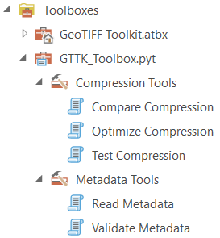

**English** | [Español](README.es.md)

# GTTK ArcGIS Pro Toolbox Setup Guide

This guide provides detailed installation and configuration instructions for the GTTK ArcGIS Pro Python Toolbox.

## Table of Contents

- [Prerequisites](#prerequisites)
- [OSGeo4W Installation](#osgeo4w-installation-required-dependency)
  - [Installation Instructions](#installation-instructions)
  - [Post-Installation Configuration](#post-installation-configuration)
  - [Verify Installation](#verify-installation)
  - [Installing QGIS via OSGeo4W](#installing-qgis-via-osgeo4w)
  - [Troubleshooting](#troubleshooting)
- [Python Environment Setup](#python-environment-setup)
- [Toolbox Setup Instructions](#toolbox-setup-instructions)
- [Toolbox Language](#toolbox-language)
- [Quick Reference](#quick-reference)

---

## Prerequisites

- **ArcGIS Pro** installed on your system
- **Administrator privileges** for OSGeo4W installation
- **GTTK** cloned or downloaded to your system

---

## OSGeo4W Installation (Required Dependency)

**CRITICAL PREREQUISITE**: For the ArcGIS Pro Toolbox to function properly, you must have a standalone GDAL environment installed. The GDAL library bundled with ArcGIS Pro uses internal configuration settings that can override optimizations implemented through the GDAL Python API.

To work around this limitation, GTTK includes a specialized tool (`gttk optimize-arc`) that uses GDAL command-line utilities (`gdal_translate`, `gdal_calc.py`, `gdalwarp`, `gdaladdo`) executed via subprocess in an isolated OSGeo4W environment. This ensures optimal results while maintaining compatibility with ArcGIS Pro.

GTTK uses OSGeo4W, which provides access to the latest GDAL features and compression codecs while remaining isolated from ArcGIS Pro's internal GDAL. Another benefit of using the OSGeo4W installer is access to the free GIS software [QGIS](https://qgis.org) (see [Installing QGIS via OSGeo4w](#installing-qgis-via-osgeo4w) below).

> **Note**: For CLI users, `gttk optimize-arc` is also available as a standalone tool. See the main README for details.

### Installation Instructions

#### Step 1: Download OSGeo4W Installer

Download the appropriate installer for your system:

- **64-bit Windows (Recommended)**: [OSGeo4W-v2-setup.exe](http://download.osgeo.org/osgeo4w/v2/osgeo4w-setup.exe)
- **Official Download Page**: [https://trac.osgeo.org/osgeo4w/](https://trac.osgeo.org/osgeo4w/)

> **Note**: The v2 installer is the modern, recommended version. Avoid the legacy v1 installer unless you have specific requirements.

#### Step 2: Run the Installer

1. **Launch** the downloaded `osgeo4w-setup.exe` with administrator privileges (right-click → "Run as administrator")

2. **Choose Installation Type**:
   - Select **"Express Install"** for a quick, standard setup (recommended for most users)
   - OR select **"Advanced Install"** for granular package control (experienced users)

#### Step 3: Select Packages (Express Install)

If using Express Install, select:

- ☑ **QGIS Desktop** - Includes QGIS and core dependencies
- ☑ **GDAL** - Geospatial Data Abstraction Library (core requirement)

#### Step 3 Alternative: Select Packages (Advanced Install)

If using Advanced Install, you'll have more control over specific packages:

**Required Packages:**

- ☑ **gdal** - Core GDAL library (select latest stable version)
- ☑ **gdal-python** - Python bindings for GDAL
- ☑ **python3-core** - Python interpreter

**Recommended Packages:**

- ☑ **qgis** - QGIS Desktop application (see below)
- ☑ **qgis-grass-plugin** - GRASS GIS integration (optional)
- ☑ **gdal-ecw** - ECW format support (if needed)
- ☑ **gdal-mrsid** - MrSID format support (if needed)

**Advanced Codec Packages** (for maximum compression options):

- ☑ **gdal-jxl** - JPEG XL codec support
- ☑ **gdal-zstd** - ZSTD compression support
- ☑ **gdal-lerc** - LERC compression support

#### Step 4: Choose Installation Location

- **Default Location**: `C:\OSGeo4W` (recommended)
- **Custom Location**: Choose a path without spaces or special characters
- **Important**: Remember this path - you'll need it for GTTK configuration

#### Step 5: Complete Installation

1. Review selected packages
2. Click **"Next"** to download and install
3. Wait for installation to complete (may take several minutes)
4. Click **"Finish"** when done

---

### Post-Installation Configuration

#### Configure GTTK to Use OSGeo4W

After installation, update the GTTK configuration to point to your OSGeo4W installation:

1. **Open** `config.toml` in the GTTK project root directory

2. **Locate** the `[paths]` section:

   ```toml
   [paths]
   # Path to OSGeo4W installation (required for ArcGIS Toolbox)
   osgeo4w = "C:/OSGeo4W"
   ```

3. **Update** the `osgeo4w` path if you installed to a custom location:

   ```toml
   [paths]
   osgeo4w = "C:/Your/Custom/Path/OSGeo4W"
   ```

---

### Verify Installation

Open **OSGeo4W Shell** (search for it in the Start Menu) and run:

```bash
# Check GDAL version
gdalinfo --version

# Check available drivers
gdalinfo --formats

# Check Python GDAL bindings version
python3 -c "from osgeo import gdal; print(gdal.__version__)"
```

Expected output should show:

- Long list of supported drivers including GTiff and COG
- Python GDAL version matching the GDAL library (3.11+ or the latest available)

---

### Installing QGIS via OSGeo4W

While QGIS is an excellent tool and valuable for GIS workflows, standalone QGIS installations may lack the complete OSGeo4W dependencies that GTTK requires. The OSGeo4W installer provides:

- **Complete GDAL Environment**: All necessary GDAL libraries, tools, and dependencies
- **Latest Compression Codecs**: Access to modern codecs like JPEG XL (JXL), ZSTD, and LERC
- **QGIS as an Option**: Includes QGIS among selectable packages - you get both!
- **Python Bindings**: GDAL Python bindings for scripting and automation
- **Consistent Updates**: Centralized update mechanism for all geospatial tools
- **Proven Compatibility**: Widely used in professional and government environments

**Benefits of Having Both ArcGIS Pro and QGIS:**

- Access to both proprietary and open-source toolsets
- QGIS excels at certain tasks (e.g., styling, PostgreSQL/PostGIS integration, raster modeling with GDAL, etc.)
- ArcGIS provides a wide suite of industry- and government-adopted mapping tools and the ArcPy environment (used by GTTK's Toobox)
- Support for analytical workflows locked behind ArcGIS Pro extensions (e.g. Spatial Analyst) requiring additional licensing
- Access to hundreds of community-developed plugins supporting unique tools
- Open-source transparency and community support

---

### Troubleshooting

**Common Issues and Solutions:**

1. **"GDAL not found" error in ArcGIS Pro Toolbox**:
   - Verify `osgeo4w` path in `config.toml` points to the correct location
   - Ensure path points to the OSGeo4W root directory (e.g., `C:/OSGeo4W`)
   - Restart ArcGIS Pro after changing configuration

2. **"Missing codec" errors (JXL, ZSTD, etc.)**:
   - Run OSGeo4W installer again and select advanced codec packages
   - Verify packages are installed: check `C:\OSGeo4W\bin\gdal\plugins`

3. **Permission errors during installation**:
   - Run installer as administrator
   - If on a managed corporate/government system, contact IT department
   - Consider installing to user-writable directory if needed

4. **PATH conflicts with other GDAL installations**:
   - GTTK uses explicit path configuration to avoid conflicts
   - Do NOT add OSGeo4W to system PATH if you have other GDAL installations
   - GTTK will use the path specified in `config.toml`

5. **`ModuleNotFoundError: No module named 'tifffile'` when the toolbox loads**:
   - ArcGIS Pro is running its default `arcgispro-py3` environment; the toolbox's error message names the interpreter in use
   - Open the **Package Manager**, activate your cloned environment and restart ArcGIS Pro
   - After an ArcGIS Pro upgrade, clone the environment again and reinstall the packages

**Getting Help:**

- OSGeo4W User Guide: [https://trac.osgeo.org/osgeo4w/wiki/TracGuide](https://trac.osgeo.org/osgeo4w/wiki/TracGuide)
- GDAL Documentation: [https://gdal.org/](https://gdal.org/)
- GTTK Issues: [Create an issue on GitHub](https://github.com/robeckgeo/gttk/issues)

---

## Python Environment Setup

**CRITICAL DEPENDENCY**: The `tifffile` module is required for GTTK to load at all, and `jsonpath-ng` is needed by Validate Metadata's PROJJSON rules. Neither is included in the default ArcGIS Pro `arcgispro-py3` conda environment, which cannot be modified, so they must be installed in a cloned environment.

### Setting Up Your Environment

1. **In ArcGIS Pro, click on the Project menu** and open the `Package Manager`. This manages the Python ArcPy conda environment(s). The pre-installed, default environment is `arcgispro-py3`.

2. **Clone the default environment** into a new environment (e.g., `arcgispro-gttk`). This may take some time. If the clone fails, you may need to work with your IT department. If you already have a cloned environment (not `arcgispro-py3`), you may use that.

3. **Make the cloned environment active**, then click on the `Add Packages` tab in the ArcGIS Pro Package Manager.

4. **Search for "tifffile"** and install it, then do the same for **"jsonpath-ng"**. Both are available in the default conda channels.

5. **Ensure that the same environment is active** when running GTTK tools from the toolbox. After upgrading ArcGIS Pro, clone the environment again: a clone made under an older release is not carried over, and Pro silently falls back to the default environment.

---

## Toolbox Setup Instructions

1. **Add Toolbox**: In your ArcGIS Pro Project, open the **Catalog** pane, right-click **Toolboxes** and select **Add Toolbox**. Navigate to and select the `toolbox` folder in the project's root directory.

2. **Locate Toolbox**: The `GTTK_Toolbox.pyt` toolbox will be visible in the Toolboxes folder. You can now expand it to use the tools.

   

---

## Toolbox Language

The toolbox displays in English or Spanish. When ArcGIS Pro loads it, the toolbox picks
the language in this order and says so in the first line of every run's messages:

1. The `GTTK_LANG` environment variable (`en` or `es`).
2. `config.toml` -- `[gui] language = "auto"` (default), `"en"` or `"es"`.
3. The display language chosen in ArcGIS Pro's **Options > Language** (only offered once
   an Esri language pack is installed).
4. The Windows display language.

To force a language, set `language = "es"` (or `"en"`) in `config.toml`, then right-click
the toolbox in the Catalog pane and choose **Refresh**. Labels, choices, messages and the
parameter help panel follow the language; reports and GDAL's own output stay in English.
ArcGIS Pro's own interface needs Esri's language pack (My Esri) to change language; the
toolbox does not.

---

## Quick Reference

| Step | Action |
|------|--------|
| 1 | Install OSGeo4W with GDAL |
| 2 | Configure `config.toml` with OSGeo4W path |
| 3 | Clone ArcGIS Pro Python environment |
| 4 | Install `tifffile` and `jsonpath-ng` in the cloned environment |
| 5 | Add toolbox to ArcGIS Pro project |
| 6 | (Optional) Force the toolbox language with `[gui] language` in `config.toml` |
